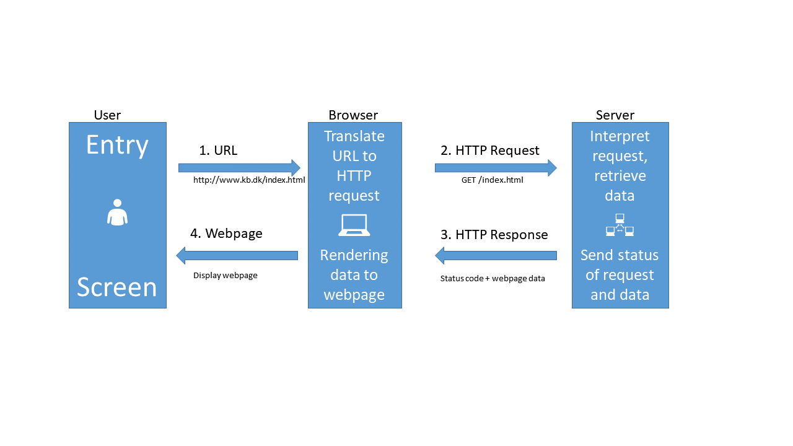
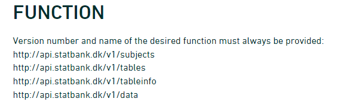

---
# Please do not edit this file directly; it is auto generated.
# Instead, please edit 03-api-in-general.md in _episodes_rmd/
title: "What is an API?"
teaching: 30
exercises: 15
output: 
  html_document:
    df_print: paged
objectives:
- Understand what an API do
- Connect to Statistics Denmark, and extract data
- Create a list of lists to control the variables to be extracted
keypoints: 
- Getting data from an API is equivalent to requesting a webpage
- POST requests to servers put specific demands on how we request data
source: Rmd
questions:
- What is an API?
editor_options: 
  markdown: 
    wrap: 72
---

Please note: These pages are autogenerated. Some of the API-calls may
fail during that process. We are figuring out what to do about it, but
please excuse us for any red errors on the pages for the time being.

## What is an API?

An API is an Application Programming Interface. It is a way of making
applications, in our case an R-script, able to communicate with another
application, here the Statistics Denmark databases.

Talking about APIs, we talk about several different things. It can be
quite confusing, but dont worry!

What we want to be able to do, is to let our own application, our
R-script, send a command to a remote application, the databases of
Statistics Denmark, in order to retrieve specific data.

This is equivalent to requesting a page from a webserver.

The HTTP protocol can be visualized like this:

-   When we type in an URL in our browser, it translates that URL to a
    HTTP-request.

-   The browser sends that HTTP-request to a webserver. The request
    contains information about the page we need, but in the "header" of
    the request, there is a lot of other information. The version of
    browser we are using and cookies to just mention two.

-   The webserver interpret the request, and retrieves the data.

-   After that, the webserver sends both the status of the request
    (hopefully 200 - which is short for "everything is OK"), and the
    data.

-   The browser receives the data, and displays it as a webpage.

When we are working with APIs we cut out the user. We have a script that
needs some data. We write code that defines, and then send a request til
a server, specifying which data we need. The server extracts the needed
data, and returns it to the script.

So - how do we do that?

Looking closer at the illustration above, we can see that we send a
GET-request to the server. But we are not only asking for at simple
page, we need to specify some more information. And then we have to use
a slightly different request to the server, a POST-request.

With a POST-request we can control what data is send along with the
request, and the data returned by the server depends on what data we
send.

We are going to write a POST-request (with a little help from R), to retrieve
data from Statistics Denmark.

But before we can do that, we need to know how the SD-API expects to receive 
data.

Hopefully we can get that by reading the documentation. We can find that here:

https://www.dst.dk/en/Statistik/brug-statistikken/muligheder-i-statistikbanken/api

That was confusing!

Three main things:

Statistics Denmark provides four "functions", or "endpoints":

The first is the "web"-site we have to send requests to if we want information 
on the subjects in Statistics Denmark.

In the second we get information about which tables are available for a 
given subject.

The third will provide metadata on a table.

When we finally need the data, we will visit the last endpoint.

Let us send a request to `subjects`.

The endpoint was 

~~~
endpoint <- "http://api.statbank.dk/v1/subjects"
~~~
{: .language-r}

We will now need to construct a named list for the content of the body that we send along with our request.

This is a new datastructure that we have not encountered before.

Vectors are annoying because they can only contain one datatype. And dataframes must be rectangular. 

A list allows us to store basically anything. The reason that we dont use them generally is that they are a bit more difficult to work with.

~~~
our_body <- list(lang = "en", recursive = FALSE, 
                  includeTables = FALSE, subjects = NULL)
~~~
{: .language-r}
This list contains four elements, with names. The first, `lang`, contains a character vector (lenght 1), containing "en", the language that we want Statistics Denmark to use when returning data.

`recursive` and `includeTables` are logical values, both false. And `subjects` is a special value, NULL. This is not a missing value, there simply isn't anything there. But this nothing does have a name.

Now we have the two things we need, an endpoint to send a request, and a body containg what we want returned. 

Let us try it:

~~~
result <- httr::POST(endpoint, body=our_body, encode = "json")
~~~
{: .language-r}

We ask to get the result in json, a speciel datastructure that is able to contain almost anything.

Let us look at the result:

~~~
result
~~~
{: .language-r}

~~~
Response [https://api.statbank.dk/v1/subjects]
  Date: 2022-04-01 10:54
  Status: 200
  Content-Type: text/json; charset=utf-8
  Size: 884 B
~~~
{: .output}
Both informative. And utterly useless. The informative information is that our request succeeded (cave - it might not succeed on this webpage). We can see that in the status. 200 is an internet code for success.

Let us get the content of the result, which is what we actually want:

~~~
httr::content(result)
~~~
{: .language-r}

~~~
[1] "[{\"id\":\"1\",\"description\":\"People\",\"active\":true,\"hasSubjects\":true,\"subjects\":[]},{\"id\":\"2\",\"description\":\"Labour and income\",\"active\":true,\"hasSubjects\":true,\"subjects\":[]},{\"id\":\"3\",\"description\":\"Economy\",\"active\":true,\"hasSubjects\":true,\"subjects\":[]},{\"id\":\"4\",\"description\":\"Social conditions\",\"active\":true,\"hasSubjects\":true,\"subjects\":[]},{\"id\":\"5\",\"description\":\"Education and research\",\"active\":true,\"hasSubjects\":true,\"subjects\":[]},{\"id\":\"6\",\"description\":\"Business\",\"active\":true,\"hasSubjects\":true,\"subjects\":[]},{\"id\":\"7\",\"description\":\"Transport\",\"active\":true,\"hasSubjects\":true,\"subjects\":[]},{\"id\":\"8\",\"description\":\"Culture and leisure\",\"active\":true,\"hasSubjects\":true,\"subjects\":[]},{\"id\":\"9\",\"description\":\"Environment and energy\",\"active\":true,\"hasSubjects\":true,\"subjects\":[]},{\"id\":\"19\",\"description\":\"Other\",\"active\":true,\"hasSubjects\":true,\"subjects\":[]}]"
~~~
{: .output}
More informative, but not really easy to read. 

The library `jsonlite` has a function that converts this to something readable:

~~~
jsonlite::fromJSON(httr::content(result))
~~~
{: .language-r}

~~~
   id            description active hasSubjects subjects
1   1                 People   TRUE        TRUE     NULL
2   2      Labour and income   TRUE        TRUE     NULL
3   3                Economy   TRUE        TRUE     NULL
4   4      Social conditions   TRUE        TRUE     NULL
5   5 Education and research   TRUE        TRUE     NULL
6   6               Business   TRUE        TRUE     NULL
7   7              Transport   TRUE        TRUE     NULL
8   8    Culture and leisure   TRUE        TRUE     NULL
9   9 Environment and energy   TRUE        TRUE     NULL
10 19                  Other   TRUE        TRUE     NULL
~~~
{: .output}

A nice dataframe with the ten major subjects in the databases of Statistics Denmark.

Subject 1 contains information about populations and elections.

There are sub-subjects under that.
We now modify our body that we send with the request, to return information about the first subject.

We need to make sure that the number of the subject, `1` is intepreted as it is. This is a little bit of mysterious handwaving - we simply put the 1 inside the function `I()` and stuff works.

~~~
our_body <- list(lang = "en", recursive = F, 
                  includeTables = F, subjects = I(1))
~~~
{: .language-r}

Note that it is important that we tell the POST function that the body is the body:

~~~
data <- httr::POST(endpoint, body=our_body, encode = "json") %>% 
  httr::content() %>% 
  jsonlite::fromJSON()
data
~~~
{: .language-r}

~~~
  id description active hasSubjects
1  1      People   TRUE        TRUE
                                                                                                                                                                                                                                                      subjects
1 3401, 3407, 3410, 3415, 3412, 3411, 3428, 3409, Population, Households, families and children, Migration, Housing, Health, Democracy, National church, Names, TRUE, TRUE, TRUE, TRUE, TRUE, TRUE, TRUE, TRUE, TRUE, TRUE, TRUE, TRUE, TRUE, TRUE, TRUE, TRUE
~~~
{: .output}

We now get at data frame containg a dataframe. We pick that out:

~~~
data$subjects
~~~
{: .language-r}

~~~
[[1]]
    id                       description active hasSubjects subjects
1 3401                        Population   TRUE        TRUE     NULL
2 3407 Households, families and children   TRUE        TRUE     NULL
3 3410                         Migration   TRUE        TRUE     NULL
4 3415                           Housing   TRUE        TRUE     NULL
5 3412                            Health   TRUE        TRUE     NULL
6 3411                         Democracy   TRUE        TRUE     NULL
7 3428                   National church   TRUE        TRUE     NULL
8 3409                             Names   TRUE        TRUE     NULL
~~~
{: .output}

This was why the dollar-notation for subsetting dataframes is important.

These are the sub-subjects of subject 1.

Let us look closer at 3401, Population.

Again, we modify the call we send to the endpoint:

~~~
our_body <- list(lang = "en", recursive = F, 
                  includeTables = F, subjects = I(3401))
~~~
{: .language-r}

~~~
data <- httr::POST(endpoint, body=our_body, encode = "json") %>% 
  httr::content() %>% 
  jsonlite::fromJSON()
data
~~~
{: .language-r}

~~~
    id description active hasSubjects
1 3401  Population   TRUE        TRUE
                                                                                                                                                                                                                                                                                              subjects
1 20021, 20024, 20022, 20019, 20017, 20018, 20014, 20015, Population figures, Immigrants and their descendants, Population projections, Adoptions, Births, Fertility, Deaths, Life expectancy, TRUE, TRUE, TRUE, FALSE, TRUE, TRUE, TRUE, TRUE, FALSE, FALSE, FALSE, FALSE, FALSE, FALSE, FALSE, FALSE
~~~
{: .output}

We delve deeper into it:

~~~
data$subjects
~~~
{: .language-r}

~~~
[[1]]
     id                      description active hasSubjects subjects
1 20021               Population figures   TRUE       FALSE     NULL
2 20024 Immigrants and their descendants   TRUE       FALSE     NULL
3 20022           Population projections   TRUE       FALSE     NULL
4 20019                        Adoptions  FALSE       FALSE     NULL
5 20017                           Births   TRUE       FALSE     NULL
6 20018                        Fertility   TRUE       FALSE     NULL
7 20014                           Deaths   TRUE       FALSE     NULL
8 20015                  Life expectancy   TRUE       FALSE     NULL
~~~
{: .output}
And now we are at the bottom. 20021 Population figures does not have any sub-sub-subjects.

Next, let us take a look at the tables contained under subject 20021.

We need the next endpoint, which provides information about tables under a subject:

~~~
endpoint <- "http://api.statbank.dk/v1/tables"
~~~
{: .language-r}

~~~
our_body <- list(lang = "en", subjects = I(20021))
data <- httr::POST(endpoint, body=our_body, encode = "json") %>% 
  httr::content() %>% 
  jsonlite::fromJSON()
data
~~~
{: .language-r}

~~~
         id                                                          text
1    FOLK1A                    Population at the first day of the quarter
2   FOLK1AM                      Population at the first day of the month
3     FOLK3                                         Population 1. January
4  FOLK3FOD                                         Population 1. January
5      BEF5                                         Population 1. January
6        FT                          Population figures from the censuses
7       BY1                                         Population 1. January
8       BY2                                         Population 1. January
9       BY3                                         Population 1. January
10      KM1                    Population at the first day of the quarter
11    SOGN1                                         Population 1. January
12   SOGN10                                         Population 1. January
13     BEF4                                         Population 1. January
14    BEF5F People born in Faroe Islands and living in Denmark 1. January
15    BEF5G     People born in Greenland and living in Denmark 1. January
16    BEV22                   Summary vital statistics (provisional data)
17   BEV107                                      Summary vital statistics
18 KMSTA003                                      Summary vital statistics
19   GALDER                                                   Average age
20 KMGALDER                                                   Average age
21    HISB3                                      Summary vital statistics
      unit             updated firstPeriod latestPeriod active
1   Number 2022-02-11T08:00:00      2008Q1       2022Q1   TRUE
2   Number 2022-03-07T08:00:00     2021M10      2022M02   TRUE
3   Number 2022-02-11T08:00:00        2008         2022   TRUE
4   Number 2022-03-18T08:00:00        2008         2022   TRUE
5   Number 2022-02-11T08:00:00        1990         2022   TRUE
6   Number 2022-02-11T08:00:00        1769         2022   TRUE
7   Number 2021-04-29T08:00:00        2010         2021   TRUE
8   Number 2021-04-29T08:00:00        2010         2021   TRUE
9        - 2021-04-29T08:00:00        2017         2021   TRUE
10  Number 2022-02-17T08:00:00      2007Q1       2022Q1   TRUE
11  Number 2022-02-17T08:00:00        2010         2022   TRUE
12  Number 2021-09-22T08:00:00        1925         2021   TRUE
13  Number 2021-03-31T08:00:00        1901         2021   TRUE
14  Number 2022-02-11T08:00:00        2008         2022   TRUE
15  Number 2022-02-11T08:00:00        2008         2022   TRUE
16  Number 2022-02-11T08:00:00      2007Q2       2021Q4   TRUE
17  Number 2022-02-11T08:00:00        2006         2021   TRUE
18  Number 2022-02-17T08:00:00        2015         2021   TRUE
19 Average 2022-02-11T08:00:00        2005         2022   TRUE
20 Average 2022-02-17T08:00:00        2007         2022   TRUE
21  Number 2022-02-11T08:00:00        1901         2022   TRUE
                                                              variables
1                                region, sex, age, marital status, time
2                                                region, sex, age, time
3                        day of birth, birth month, year of birth, time
4                     day of birth, birth month, country of birth, time
5                                      sex, age, country of birth, time
6                                                   national part, time
7                                 urban and rural areas, age, sex, time
8                               municipality, city size, age, sex, time
9  urban and rural areas, population, area and population density, time
10                          parish, member of the National Church, time
11                                               parish, sex, age, time
12                                                         parish, time
13                                                        islands, time
14                               sex, age, parents place of birth, time
15                               sex, age, parents place of birth, time
16                                  region, type of movement, sex, time
17                                  region, type of movement, sex, time
18                                              parish, movements, time
19                                              municipality, sex, time
20                                                    parish, sex, time
21                                               type of movement, time
~~~
{: .output}

There are 21 tables under this subject. Let us see what information we can get about table "FOLK1A":

We now need the third endpoint:

~~~
endpoint <- "http://api.statbank.dk/v1/tableinfo"
~~~
{: .language-r}

~~~
our_body <- list(lang = "en", table = "FOLK1A")
data <- httr::POST(endpoint, body=our_body, encode = "json") %>% 
  httr::content() %>% 
  jsonlite::fromJSON()
data
~~~
{: .language-r}

~~~
$id
[1] "FOLK1A"

$text
[1] "Population at the first day of the quarter"

$description
[1] "Population at the first day of the quarter by region, sex, age, marital status and time"

$unit
[1] "Number"

$suppressedDataValue
[1] "0"

$updated
[1] "2022-02-11T08:00:00"

$active
[1] TRUE

$contacts
           name       phone       mail
1 Dorthe Larsen +4539173307 dla@dst.dk

$documentation
$documentation$id
[1] "4a12721d-a8b0-4bde-82d7-1d1c6f319de3"

$documentation$url
[1] "https://www.dst.dk/documentationofstatistics/4a12721d-a8b0-4bde-82d7-1d1c6f319de3"

$footnote
NULL

$variables
          id           text elimination  time                     map
1     OMRÅDE         region        TRUE FALSE denmark_municipality_07
2        KØN            sex        TRUE FALSE                    <NA>
3      ALDER            age        TRUE FALSE                    <NA>
4 CIVILSTAND marital status        TRUE FALSE                    <NA>
5        Tid           time       FALSE  TRUE                    <NA>
                                                                                                                                                                                                                                                                                                                                                                                                                                                                                                                                                                                                                                                                                                                                                                                                                                                                                                                                                                                                                                                                                                                                                                                                                                                                                                                                                                                                                                                                                                                                                                                                                                                                                                                                                                                                                                                                          values
1                                                                                                                                                                                      000, 084, 101, 147, 155, 185, 165, 151, 153, 157, 159, 161, 163, 167, 169, 183, 173, 175, 187, 201, 240, 210, 250, 190, 270, 260, 217, 219, 223, 230, 400, 411, 085, 253, 259, 350, 265, 269, 320, 376, 316, 326, 360, 370, 306, 329, 330, 340, 336, 390, 083, 420, 430, 440, 482, 410, 480, 450, 461, 479, 492, 530, 561, 563, 607, 510, 621, 540, 550, 573, 575, 630, 580, 082, 710, 766, 615, 707, 727, 730, 741, 740, 746, 706, 751, 657, 661, 756, 665, 760, 779, 671, 791, 081, 810, 813, 860, 849, 825, 846, 773, 840, 787, 820, 851, All Denmark, Region Hovedstaden, Copenhagen, Frederiksberg, Dragør, Tårnby, Albertslund, Ballerup, Brøndby, Gentofte, Gladsaxe, Glostrup, Herlev, Hvidovre, Høje-Taastrup, Ishøj, Lyngby-Taarbæk, Rødovre, Vallensbæk, Allerød, Egedal, Fredensborg, Frederikssund, Furesø, Gribskov, Halsnæs, Helsingør, Hillerød, Hørsholm, Rudersdal, Bornholm, Christiansø, Region Sjælland, Greve, Køge, Lejre, Roskilde, Solrød, Faxe, Guldborgsund, Holbæk, Kalundborg, Lolland, Næstved, Odsherred, Ringsted, Slagelse, Sorø, Stevns, Vordingborg, Region Syddanmark, Assens, Faaborg-Midtfyn, Kerteminde, Langeland, Middelfart, Nordfyns, Nyborg, Odense, Svendborg, Ærø, Billund, Esbjerg, Fanø, Fredericia, Haderslev, Kolding, Sønderborg, Tønder, Varde, Vejen, Vejle, Aabenraa, Region Midtjylland, Favrskov, Hedensted, Horsens, Norddjurs, Odder, Randers, Samsø, Silkeborg, Skanderborg, Syddjurs, Aarhus, Herning, Holstebro, Ikast-Brande, Lemvig, Ringkøbing-Skjern, Skive, Struer, Viborg, Region Nordjylland, Brønderslev, Frederikshavn, Hjørring, Jammerbugt, Læsø, Mariagerfjord, Morsø, Rebild, Thisted, Vesthimmerlands, Aalborg
2                                                                                                                                                                                                                                                                                                                                                                                                                                                                                                                                                                                                                                                                                                                                                                                                                                                                                                                                                                                                                                                                                                                                                                                                                                                                                                                                                                                                                                                                                                                                                                                                                                                                                                                                                                                                                                                   TOT, 1, 2, Total, Men, Women
3 IALT, 0, 1, 2, 3, 4, 5, 6, 7, 8, 9, 10, 11, 12, 13, 14, 15, 16, 17, 18, 19, 20, 21, 22, 23, 24, 25, 26, 27, 28, 29, 30, 31, 32, 33, 34, 35, 36, 37, 38, 39, 40, 41, 42, 43, 44, 45, 46, 47, 48, 49, 50, 51, 52, 53, 54, 55, 56, 57, 58, 59, 60, 61, 62, 63, 64, 65, 66, 67, 68, 69, 70, 71, 72, 73, 74, 75, 76, 77, 78, 79, 80, 81, 82, 83, 84, 85, 86, 87, 88, 89, 90, 91, 92, 93, 94, 95, 96, 97, 98, 99, 100, 101, 102, 103, 104, 105, 106, 107, 108, 109, 110, 111, 112, 113, 114, 115, 116, 117, 118, 119, 120, 121, 122, 123, 124, 125, Total, 0 years, 1 year, 2 years, 3 years, 4 years, 5 years, 6 years, 7 years, 8 years, 9 years, 10 years, 11 years, 12 years, 13 years, 14 years, 15 years, 16 years, 17 years, 18 years, 19 years, 20 years, 21 years, 22 years, 23 years, 24 years, 25 years, 26 years, 27 years, 28 years, 29 years, 30 years, 31 years, 32 years, 33 years, 34 years, 35 years, 36 years, 37 years, 38 years, 39 years, 40 years, 41 years, 42 years, 43 years, 44 years, 45 years, 46 years, 47 years, 48 years, 49 years, 50 years, 51 years, 52 years, 53 years, 54 years, 55 years, 56 years, 57 years, 58 years, 59 years, 60 years, 61 years, 62 years, 63 years, 64 years, 65 years, 66 years, 67 years, 68 years, 69 years, 70 years, 71 years, 72 years, 73 years, 74 years, 75 years, 76 years, 77 years, 78 years, 79 years, 80 years, 81 years, 82 years, 83 years, 84 years, 85 years, 86 years, 87 years, 88 years, 89 years, 90 years, 91 years, 92 years, 93 years, 94 years, 95 years, 96 years, 97 years, 98 years, 99 years, 100 years, 101 years, 102 years, 103 years, 104 years, 105 years, 106 years, 107 years, 108 years, 109 years, 110 years, 111 years, 112 years, 113 years, 114 years, 115 years, 116 years, 117 years, 118 years, 119 years, 120 years, 121 years, 122 years, 123 years, 124 years, 125 years
4                                                                                                                                                                                                                                                                                                                                                                                                                                                                                                                                                                                                                                                                                                                                                                                                                                                                                                                                                                                                                                                                                                                                                                                                                                                                                                                                                                                                                                                                                                                                                                                                                                                                                                                                                                                                    TOT, U, G, E, F, Total, Never married, Married/separated, Widowed, Divorced
5                                                                                                                                                                                                                                                                                                                                                                                                                                                                                                                                                                                                                                                                                                                                                                                                                                                                                                                                 2008K1, 2008K2, 2008K3, 2008K4, 2009K1, 2009K2, 2009K3, 2009K4, 2010K1, 2010K2, 2010K3, 2010K4, 2011K1, 2011K2, 2011K3, 2011K4, 2012K1, 2012K2, 2012K3, 2012K4, 2013K1, 2013K2, 2013K3, 2013K4, 2014K1, 2014K2, 2014K3, 2014K4, 2015K1, 2015K2, 2015K3, 2015K4, 2016K1, 2016K2, 2016K3, 2016K4, 2017K1, 2017K2, 2017K3, 2017K4, 2018K1, 2018K2, 2018K3, 2018K4, 2019K1, 2019K2, 2019K3, 2019K4, 2020K1, 2020K2, 2020K3, 2020K4, 2021K1, 2021K2, 2021K3, 2021K4, 2022K1, 2008Q1, 2008Q2, 2008Q3, 2008Q4, 2009Q1, 2009Q2, 2009Q3, 2009Q4, 2010Q1, 2010Q2, 2010Q3, 2010Q4, 2011Q1, 2011Q2, 2011Q3, 2011Q4, 2012Q1, 2012Q2, 2012Q3, 2012Q4, 2013Q1, 2013Q2, 2013Q3, 2013Q4, 2014Q1, 2014Q2, 2014Q3, 2014Q4, 2015Q1, 2015Q2, 2015Q3, 2015Q4, 2016Q1, 2016Q2, 2016Q3, 2016Q4, 2017Q1, 2017Q2, 2017Q3, 2017Q4, 2018Q1, 2018Q2, 2018Q3, 2018Q4, 2019Q1, 2019Q2, 2019Q3, 2019Q4, 2020Q1, 2020Q2, 2020Q3, 2020Q4, 2021Q1, 2021Q2, 2021Q3, 2021Q4, 2022Q1
~~~
{: .output}

This is a bit more complicated. We are told that:

1. there are five columns in this table.

2. They each have an id

3. And a descriptive text

4. Elimination means that the API will attempt to eliminate the variables we have not chosen values for when data is returned. This makes sense when we get to point 7.

5. time - only one of the variables contain information about a point in time.

6. One of the variables can be mapped to - well a map

7. The final column provides information about which values are stored in the variable. There are 105 different regions in Denmark. And if we do not choose a specific region - the API will attempt to eliminate this facetting, and return data for all of Denmark.

These data provides useful information for constructing the final call to the API in order to get the data.

We will now need the final endpoint:

~~~
endpoint <- "http://api.statbank.dk/v1/data"
~~~
{: .language-r}

And we will need to specify which information, from which table, we want data in the body of the request. That is a bit more complicated. We need to make a list of lists!

~~~
variables <- list(list(code = "OMRÅDE", values = I("*")),
                  list(code = "CIVILSTAND", values = I(c("U", "G", "E", "F"))),
                  list(code = "Tid", values = I("*"))
              )

our_body <- list(table = "FOLK1A", lang = "en", format = "CSV", variables = variables)
~~~
{: .language-r}

The final endpoint is:

~~~
endpoint <- "https://api.statbank.dk/v1/data"
~~~
{: .language-r}

And the call:

~~~
data <- httr::POST(endpoint, body=our_body, encode = "json")
~~~
{: .language-r}

The data is returned as csv - we defined that in "our_body", so we now need to extract it a bit differently:

~~~
data <- data %>% 
  httr::content(type = "text") %>% 
  read_csv2()
~~~
{: .language-r}

~~~
ℹ Using "','" as decimal and "'.'" as grouping mark. Use `read_delim()` for more control.
~~~
{: .output}

~~~
No encoding supplied: defaulting to UTF-8.
~~~
{: .output}

~~~
Rows: 23940 Columns: 4
── Column specification ────────────────────────────────────────────────────────
Delimiter: ";"
chr (3): OMRÅDE, CIVILSTAND, TID
dbl (1): INDHOLD

ℹ Use `spec()` to retrieve the full column specification for this data.
ℹ Specify the column types or set `show_col_types = FALSE` to quiet this message.
~~~
{: .output}

~~~
data
~~~
{: .language-r}

~~~
# A tibble: 23,940 × 4
   OMRÅDE      CIVILSTAND    TID    INDHOLD
   <chr>       <chr>         <chr>    <dbl>
 1 All Denmark Never married 2008Q1 2552700
 2 All Denmark Never married 2008Q2 2563134
 3 All Denmark Never married 2008Q3 2564705
 4 All Denmark Never married 2008Q4 2568255
 5 All Denmark Never married 2009Q1 2575185
 6 All Denmark Never married 2009Q2 2584993
 7 All Denmark Never married 2009Q3 2584560
 8 All Denmark Never married 2009Q4 2588198
 9 All Denmark Never married 2010Q1 2593172
10 All Denmark Never married 2010Q2 2604129
# … with 23,930 more rows
~~~
{: .output}

Voila! We have a dataframe with information about how many persons in Denmark were married (or not) at different points in time.

That was a bit complicated. There are easier ways to do it.

We will look at that shortly. So why do it this way? These techniques are the same techniques we use when we access an arbitrary other API. The fields, endpoints etc might be different. We might have an added complication of having to login to it. But the techniques can be reused.

