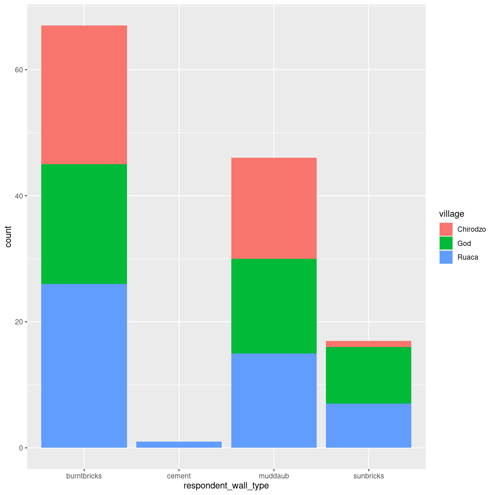
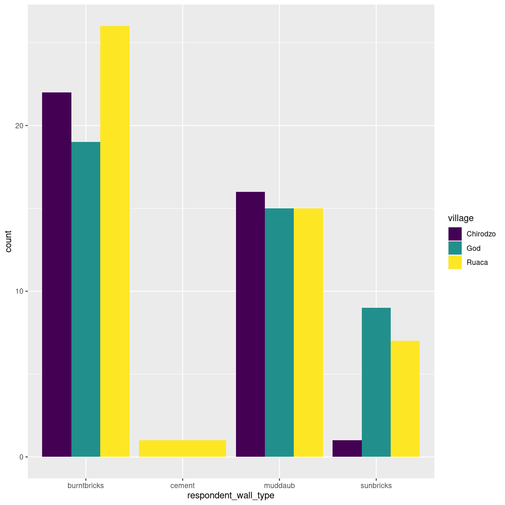

---
# Please do not edit this file directly; it is auto generated.
# Instead, please edit 05-api.md in _episodes_rmd/
title: "What is an API?"
teaching: 30
exercises: 15
output: 
  html_document:
    df_print: paged
objectives:
- Create a .Rmd document containing R code, text, and plots
- Create a YAML header to control output
- Understand basic syntax of (R)Markdown
- Customise code chunks to control formatting
- Use code chunks and in-line code to create dynamic, reproducible documents
keypoints: 
- R Markdown is a useful language for creating reproducible documents combining text and executable R-code.
- Specify chunk options to control formatting of the output document
source: Rmd
questions:
- What is R Markdown?
- How can I integrate my R code with text and plots?
- How can I convert .Rmd files to .html?
---


## What is an API?

An API is an Application Programming Interface. It is a way of making 
applications, in our case an R-script, able to communicate with another 
application, here the Statistics Denmark databases.

Talking about APIs, we talk about several different things. It can be quite 
confusing, but dont worry!

What we want to be able to do, is to let our own application, our R-script,
send a command to a remote application, the databases of Statistics Denmark, 
in order to retrieve specific data.

An API defines the different commands we can send, and how the data that we 
get back, is formatted.

Often APIs will require a user account with a login and a password. 
Statistics Denmark does not.

The standard way to send a command, or a request, to an API is to use the 
GET (and POST) functions at the core of the internet. 

In a certain sense this is what we do when we access a website. We go to 
www.dr.dk/sporten and get a result, the current webpage at the front of 
the sports section of Danmarks Radio. 

If we instead ask www.dr.dk to return the result of our request for 
www.dr.dk/nyheder/politik, we will get the current webpage with news on politics.

This is what we do when we access an API. But instead of using our browser, we
use the method our browser uses (GET), tells that method that we would like 
some specified information, and get a result that is not a webpage, but rather
a set of data. Hopefully organised in a way that is easy to read.

Writing our own GET-requests to communicate with an API is not simple. 
Thankfully kind people have written libraries, some in R, that makes accessing 
specific APIs easier. The one we are going to use here is called "danstat"

## The danstat package/library


Before doing anything else, it is useful to take a look at the result:

~~~
Rows: 220 Columns: 4
~~~
{: .output}


~~~
── Column specification ────────────────────────────────────────────────────────
Delimiter: ";"
chr (3): IELAND, KØN, TID
dbl (1): INDHOLD
~~~
{: .output}


~~~

ℹ Use `spec()` to retrieve the full column specification for this data.
ℹ Specify the column types or set `show_col_types = FALSE` to quiet this message.
~~~
{: .output}


~~~
Error in data %>% head: could not find function "%>%"
~~~
{: .error}

This is from the table "folk1c" from Statistics Denmark.
We get some variables, IELAND, KØN, and TID. And then the content of the table, 
INDHOLD. Ie the number of men, living in denmark i the first quarter of 2008 in
the first line.

How do we get that table?

All tables from Statistics Denmark are organised in a hierarcical tree of 
subjects. 

Let us begin there.

Before using the library, we need to install it:


~~~
install.packages("danstat")
~~~
{: .language-r}

After installation, we load the library using the library function. And then 
we can access the functions included in the library:


~~~
library(danstat)
subjects <- get_subjects()
subjects
~~~
{: .language-r}


~~~
   id                               description active hasSubjects subjects
1  02                  Population and elections   TRUE        TRUE     NULL
2  04                 Labour, income and wealth   TRUE        TRUE     NULL
3  06                    Prices and consumption   TRUE        TRUE     NULL
4  05                         Living conditions   TRUE        TRUE     NULL
5  14 National accounts and government finances   TRUE        TRUE     NULL
6  03                   Education and knowledge   TRUE        TRUE     NULL
7  11                          Business sectors   TRUE        TRUE     NULL
8  07                Business sector in general   TRUE        TRUE     NULL
9  16                   Money and credit market   TRUE        TRUE     NULL
10 13                          External economy   TRUE        TRUE     NULL
11 18               Culture and National Church   TRUE        TRUE     NULL
12 01         Geography, environment and energy   TRUE        TRUE     NULL
13 19                                     Other   TRUE        TRUE     NULL
~~~
{: .output}

We get the 13 major subjects from Statistics Denmark. Each of them have sub-subjects.

Let us try to get the sub-subjects from the subject 02 - containing information
about populations and elections:


~~~
sub_subjects <- get_subjects(subjects = "02")
sub_subjects
~~~
{: .language-r}


~~~
  id              description active hasSubjects
1 02 Population and elections   TRUE        TRUE
                                                                                                                                                                                                                                                                                                                                                                subjects
1 2401, 2402, 2405, 2406, 2407, 2408, 2410, 2409, 2411, Population and population projections, Immigrants and their descendants, Births, Deaths and life expectancy, Households, families and children, Marriages and divorces, Migrations, Names, Elections, TRUE, TRUE, TRUE, TRUE, TRUE, TRUE, TRUE, TRUE, TRUE, TRUE, TRUE, TRUE, TRUE, TRUE, TRUE, TRUE, TRUE, TRUE
~~~
{: .output}


Statistics Denmark give access to 13 collections of data, organised in 
subjects. 

The get_subjects() function sends a request to the Statistics Denmark API, asking
for a list of the subjects. The information is returned to our script, and the
get_subjects() function presents us with a dataframe containing the information.

Each subject have sub-subjects. If we want to take a closer look at the 
subdivisions of a given subject, we use the get_subjects() function again,
this time specifying which subject we are interested in:


~~~
subject <- get_subjects("02")
subject
~~~
{: .language-r}


~~~
  id              description active hasSubjects
1 02 Population and elections   TRUE        TRUE
                                                                                                                                                                                                                                                                                                                                                                subjects
1 2401, 2402, 2405, 2406, 2407, 2408, 2410, 2409, 2411, Population and population projections, Immigrants and their descendants, Births, Deaths and life expectancy, Households, families and children, Marriages and divorces, Migrations, Names, Elections, TRUE, TRUE, TRUE, TRUE, TRUE, TRUE, TRUE, TRUE, TRUE, TRUE, TRUE, TRUE, TRUE, TRUE, TRUE, TRUE, TRUE, TRUE
~~~
{: .output}

The result is a bit complicated. The column "subjects" in the resulting dataframe
contains another dataframe. We access it like we normally would access a 
column in a dataframe:


~~~
subject$subjects
~~~
{: .language-r}


~~~
[[1]]
    id                           description active hasSubjects subjects
1 2401 Population and population projections   TRUE        TRUE     NULL
2 2402      Immigrants and their descendants   TRUE        TRUE     NULL
3 2405                                Births   TRUE        TRUE     NULL
4 2406            Deaths and life expectancy   TRUE        TRUE     NULL
5 2407     Households, families and children   TRUE        TRUE     NULL
6 2408                Marriages and divorces   TRUE        TRUE     NULL
7 2410                            Migrations   TRUE        TRUE     NULL
8 2409                                 Names   TRUE        TRUE     NULL
9 2411                             Elections   TRUE        TRUE     NULL
~~~
{: .output}

Those sub-subjects have their own subjects! Lets get to the bottom of this:


~~~
sub_sub_subjects <- get_subjects("2401")
sub_sub_subjects$subjects
~~~
{: .language-r}


~~~
[[1]]
     id            description active hasSubjects subjects
1 10021  Population in Denmark   TRUE       FALSE     NULL
2 10022 Population projections   TRUE       FALSE     NULL
~~~
{: .output}
get_subjects is able to retrieve all the sub, sub-sub and sub-sub-sub-jects in
one go. The result is a bit confusing and difficult to navigate.

Remember that the initial result was a dataframe containing another dataframe.
If we go all the way to the bottom, we will get a dataframe, containing several
dataframes, each of those containing several dataframes. 

We recommend that you do not try it, but this is how it is done:

~~~
lots_of_subjects <- get_subjects("02", recursive = T, include_tables = T)
~~~
{: .language-r}

For each of the final subjects, there are several tables available, containing data.

How do we find out which tables exists?

The get_tables() function returns a dataframe with information about the 
tables available for a given subject.


~~~
tables <- get_tables(subjects="10021")
tables
~~~
{: .language-r}


~~~
         id                                                          text
1    FOLK1A                    Population at the first day of the quarter
2    FOLK1B                    Population at the first day of the quarter
3    FOLK1C                    Population at the first day of the quarter
4    FOLK1D                    Population at the first day of the quarter
5    FOLK1E                    Population at the first day of the quarter
6     FOLK2                                         Population 1. January
7   INDOPH1                                         Immigrants 1. January
8   INDOPH2                                         Immigrants 1. January
9    KRYDS1                                         Population 1. January
10   KRYDS2                            People of Danish origin 1. January
11   KRYDS3                                         Population 1. January
12   KRYDS4                                         Population 1. January
13    FOLK3                                         Population 1. January
14       FT                          Population figures from the censuses
15    BEF5F People born in Faroe Islands and living in Denmark 1. January
16    BEF5G     People born in Greenland and living in Denmark 1. January
17     BEF5                                         Population 1. January
18      BY3                                         Population 1. January
19      BY1                                         Population 1. January
20      BY4                                         Households 1. January
21      BY2                                         Population 1. January
22     BEF4                                         Population 1. January
23    HISB3                                      Summary vital statistics
24    BEV22                   Summary vital statistics (provisional data)
25   BEV107                                      Summary vital statistics
26   GALDER                                                   Average age
27 KMGALDER                                                   Average age
28      KM1                    Population at the first day of the quarter
29      KM5                                         Population 1. January
30    SOGN1                                         Population 1. January
31   SOGN10                                         Population 1. January
32 KMSTA003                                      Summary vital statistics
      unit             updated firstPeriod latestPeriod active
1   Number 2021-08-11T08:00:00      2008Q1       2021Q3   TRUE
2   Number 2021-08-11T08:00:00      2008Q1       2021Q3   TRUE
3   Number 2021-08-11T08:00:00      2008Q1       2021Q3   TRUE
4   Number 2021-08-11T08:00:00      2008Q1       2021Q3   TRUE
5   Number 2021-08-11T08:00:00      2008Q1       2021Q3   TRUE
6   Number 2021-02-11T08:00:00        1980         2021   TRUE
7   Number 2021-06-01T08:00:00        2008         2021   TRUE
8   Number 2021-06-01T08:00:00        2008         2021   TRUE
9   Number 2021-02-11T08:00:00        2019         2021   TRUE
10  Number 2021-02-11T08:00:00        2019         2021   TRUE
11  Number 2021-02-11T08:00:00        2019         2021   TRUE
12  Number 2021-02-11T08:00:00        2019         2021   TRUE
13  Number 2021-02-11T08:00:00        2008         2021   TRUE
14  Number 2021-02-11T08:00:00        1769         2021   TRUE
15  Number 2021-02-11T08:00:00        2008         2021   TRUE
16  Number 2021-02-11T08:00:00        2008         2021   TRUE
17  Number 2021-02-11T08:00:00        1990         2021   TRUE
18       - 2021-04-29T08:00:00        2017         2021   TRUE
19  Number 2021-04-29T08:00:00        2010         2021   TRUE
20  Number 2021-05-19T08:00:00        2010         2021   TRUE
21  Number 2021-04-29T08:00:00        2010         2021   TRUE
22  Number 2021-03-31T08:00:00        1901         2021   TRUE
23  Number 2021-02-12T08:00:00        1901         2021   TRUE
24  Number 2021-08-11T08:00:00      2007Q2       2021Q2   TRUE
25  Number 2021-02-11T08:00:00        2006         2020   TRUE
26 Average 2021-02-11T08:00:00        2005         2021   TRUE
27 Average 2021-02-11T08:00:00        2007         2021   TRUE
28  Number 2021-08-11T08:00:00      2007Q1       2021Q3   TRUE
29  Number 2021-02-11T08:00:00        2007         2021   TRUE
30  Number 2021-02-11T08:00:00        2010         2021   TRUE
31  Number 2020-09-16T08:00:00        1925         2020   TRUE
32  Number 2021-02-11T08:00:00        2015         2020   TRUE
                                                                                                                                                                                                                                               variables
1                                                                                                                                                                                                                 region, sex, age, marital status, time
2                                                                                                                                                                                                                    region, sex, age, citizenship, time
3                                                                                                                                                                                                    region, sex, age, ancestry, country of origin, time
4                                                                                                                                                                                                                    region, sex, age, citizenship, time
5                                                                                                                                                                                                                       region, sex, age, ancestry, time
6                                                                                                                                                                                               age, sex, ancestry, citizenship, country of origin, time
7                                                                                                                                                                                                                first permit of residence, region, time
8                                                                                                                                                                                          first permit of residence, group of countries of origin, time
9  The origin of the main character, The country of birth of the main character, The citizenship of the main character, The country of birth of the mother, mothers citizenship, The country of birth of the father, the citizenship of the father, time
10                                                                                                                          The country of birth of the main character, country of birth and citizenship of the parents, age of the main character, time
11                                                                                            The origin of the main character, The country of birth of the main character, The country of birth of the mother, The country of birth of the father, time
12                                                                                                                                    The origin of the main character, country of birth and citizenship of the parents, age of the main character, time
13                                                                                                                                                                                                        day of birth, birth month, year of birth, time
14                                                                                                                                                                                                                                   national part, time
15                                                                                                                                                                                                                sex, age, parents place of birth, time
16                                                                                                                                                                                                                sex, age, parents place of birth, time
17                                                                                                                                                                                                                      sex, age, country of birth, time
18                                                                                                                                                                                  urban and rural areas, population, area and population density, time
19                                                                                                                                                                                                                 urban and rural areas, age, sex, time
20                                                                                                                                                                                    urban and rural areas, type of household, number of children, time
21                                                                                                                                                                                                               municipality, city size, age, sex, time
22                                                                                                                                                                                                                                         islands, time
23                                                                                                                                                                                                                                type of movement, time
24                                                                                                                                                                                                                   region, type of movement, sex, time
25                                                                                                                                                                                                                   region, type of movement, sex, time
26                                                                                                                                                                                                                               municipality, sex, time
27                                                                                                                                                                                                                                     parish, sex, time
28                                                                                                                                                                                                           parish, member of the National Church, time
29                                                                                                                                                                                                 parish, sex, age, member of the National Church, time
30                                                                                                                                                                                                                                parish, sex, age, time
31                                                                                                                                                                                                                                          parish, time
32                                                                                                                                                                                                                               parish, movements, time
~~~
{: .output}
We get at lot of information here. The id identifies the table, text gives a 
description of the table that humans can understand. When the table was last
updated and the first and last period that the table contains data for.

In the variables column, we get information on what kind of data is stored in 
the table.


~~~
metadata <- get_table_metadata("FOLK1A", variables_only = T)
metadata
~~~
{: .language-r}


~~~
          id           text elimination  time                     map
1     OMRÅDE         region        TRUE FALSE denmark_municipality_07
2        KØN            sex        TRUE FALSE                    <NA>
3      ALDER            age        TRUE FALSE                    <NA>
4 CIVILSTAND marital status        TRUE FALSE                    <NA>
5        Tid           time       FALSE  TRUE                    <NA>
                                                                                                                                                                                                                                                                                                                                                                                                                                                                                                                                                                                                                                                                                                                                                                                                                                                                                                                                                                                                                                                                                                                                                                                                                                                                                                                                                                                                                                                                                                                                                                                                                                                                                                                                                                                                                                                                          values
1                                                                                                                                                                                      000, 084, 101, 147, 155, 185, 165, 151, 153, 157, 159, 161, 163, 167, 169, 183, 173, 175, 187, 201, 240, 210, 250, 190, 270, 260, 217, 219, 223, 230, 400, 411, 085, 253, 259, 350, 265, 269, 320, 376, 316, 326, 360, 370, 306, 329, 330, 340, 336, 390, 083, 420, 430, 440, 482, 410, 480, 450, 461, 479, 492, 530, 561, 563, 607, 510, 621, 540, 550, 573, 575, 630, 580, 082, 710, 766, 615, 707, 727, 730, 741, 740, 746, 706, 751, 657, 661, 756, 665, 760, 779, 671, 791, 081, 810, 813, 860, 849, 825, 846, 773, 840, 787, 820, 851, All Denmark, Region Hovedstaden, Copenhagen, Frederiksberg, Dragør, Tårnby, Albertslund, Ballerup, Brøndby, Gentofte, Gladsaxe, Glostrup, Herlev, Hvidovre, Høje-Taastrup, Ishøj, Lyngby-Taarbæk, Rødovre, Vallensbæk, Allerød, Egedal, Fredensborg, Frederikssund, Furesø, Gribskov, Halsnæs, Helsingør, Hillerød, Hørsholm, Rudersdal, Bornholm, Christiansø, Region Sjælland, Greve, Køge, Lejre, Roskilde, Solrød, Faxe, Guldborgsund, Holbæk, Kalundborg, Lolland, Næstved, Odsherred, Ringsted, Slagelse, Sorø, Stevns, Vordingborg, Region Syddanmark, Assens, Faaborg-Midtfyn, Kerteminde, Langeland, Middelfart, Nordfyns, Nyborg, Odense, Svendborg, Ærø, Billund, Esbjerg, Fanø, Fredericia, Haderslev, Kolding, Sønderborg, Tønder, Varde, Vejen, Vejle, Aabenraa, Region Midtjylland, Favrskov, Hedensted, Horsens, Norddjurs, Odder, Randers, Samsø, Silkeborg, Skanderborg, Syddjurs, Aarhus, Herning, Holstebro, Ikast-Brande, Lemvig, Ringkøbing-Skjern, Skive, Struer, Viborg, Region Nordjylland, Brønderslev, Frederikshavn, Hjørring, Jammerbugt, Læsø, Mariagerfjord, Morsø, Rebild, Thisted, Vesthimmerlands, Aalborg
2                                                                                                                                                                                                                                                                                                                                                                                                                                                                                                                                                                                                                                                                                                                                                                                                                                                                                                                                                                                                                                                                                                                                                                                                                                                                                                                                                                                                                                                                                                                                                                                                                                                                                                                                                                                                                                                   TOT, 1, 2, Total, Men, Women
3 IALT, 0, 1, 2, 3, 4, 5, 6, 7, 8, 9, 10, 11, 12, 13, 14, 15, 16, 17, 18, 19, 20, 21, 22, 23, 24, 25, 26, 27, 28, 29, 30, 31, 32, 33, 34, 35, 36, 37, 38, 39, 40, 41, 42, 43, 44, 45, 46, 47, 48, 49, 50, 51, 52, 53, 54, 55, 56, 57, 58, 59, 60, 61, 62, 63, 64, 65, 66, 67, 68, 69, 70, 71, 72, 73, 74, 75, 76, 77, 78, 79, 80, 81, 82, 83, 84, 85, 86, 87, 88, 89, 90, 91, 92, 93, 94, 95, 96, 97, 98, 99, 100, 101, 102, 103, 104, 105, 106, 107, 108, 109, 110, 111, 112, 113, 114, 115, 116, 117, 118, 119, 120, 121, 122, 123, 124, 125, Total, 0 years, 1 year, 2 years, 3 years, 4 years, 5 years, 6 years, 7 years, 8 years, 9 years, 10 years, 11 years, 12 years, 13 years, 14 years, 15 years, 16 years, 17 years, 18 years, 19 years, 20 years, 21 years, 22 years, 23 years, 24 years, 25 years, 26 years, 27 years, 28 years, 29 years, 30 years, 31 years, 32 years, 33 years, 34 years, 35 years, 36 years, 37 years, 38 years, 39 years, 40 years, 41 years, 42 years, 43 years, 44 years, 45 years, 46 years, 47 years, 48 years, 49 years, 50 years, 51 years, 52 years, 53 years, 54 years, 55 years, 56 years, 57 years, 58 years, 59 years, 60 years, 61 years, 62 years, 63 years, 64 years, 65 years, 66 years, 67 years, 68 years, 69 years, 70 years, 71 years, 72 years, 73 years, 74 years, 75 years, 76 years, 77 years, 78 years, 79 years, 80 years, 81 years, 82 years, 83 years, 84 years, 85 years, 86 years, 87 years, 88 years, 89 years, 90 years, 91 years, 92 years, 93 years, 94 years, 95 years, 96 years, 97 years, 98 years, 99 years, 100 years, 101 years, 102 years, 103 years, 104 years, 105 years, 106 years, 107 years, 108 years, 109 years, 110 years, 111 years, 112 years, 113 years, 114 years, 115 years, 116 years, 117 years, 118 years, 119 years, 120 years, 121 years, 122 years, 123 years, 124 years, 125 years
4                                                                                                                                                                                                                                                                                                                                                                                                                                                                                                                                                                                                                                                                                                                                                                                                                                                                                                                                                                                                                                                                                                                                                                                                                                                                                                                                                                                                                                                                                                                                                                                                                                                                                                                                                                                                    TOT, U, G, E, F, Total, Never married, Married/separated, Widowed, Divorced
5                                                                                                                                                                                                                                                                                                                                                                                                                                                                                                                                                                                                                                                                                                                                                                                                                                                                                                                                                                 2008K1, 2008K2, 2008K3, 2008K4, 2009K1, 2009K2, 2009K3, 2009K4, 2010K1, 2010K2, 2010K3, 2010K4, 2011K1, 2011K2, 2011K3, 2011K4, 2012K1, 2012K2, 2012K3, 2012K4, 2013K1, 2013K2, 2013K3, 2013K4, 2014K1, 2014K2, 2014K3, 2014K4, 2015K1, 2015K2, 2015K3, 2015K4, 2016K1, 2016K2, 2016K3, 2016K4, 2017K1, 2017K2, 2017K3, 2017K4, 2018K1, 2018K2, 2018K3, 2018K4, 2019K1, 2019K2, 2019K3, 2019K4, 2020K1, 2020K2, 2020K3, 2020K4, 2021K1, 2021K2, 2021K3, 2008Q1, 2008Q2, 2008Q3, 2008Q4, 2009Q1, 2009Q2, 2009Q3, 2009Q4, 2010Q1, 2010Q2, 2010Q3, 2010Q4, 2011Q1, 2011Q2, 2011Q3, 2011Q4, 2012Q1, 2012Q2, 2012Q3, 2012Q4, 2013Q1, 2013Q2, 2013Q3, 2013Q4, 2014Q1, 2014Q2, 2014Q3, 2014Q4, 2015Q1, 2015Q2, 2015Q3, 2015Q4, 2016Q1, 2016Q2, 2016Q3, 2016Q4, 2017Q1, 2017Q2, 2017Q3, 2017Q4, 2018Q1, 2018Q2, 2018Q3, 2018Q4, 2019Q1, 2019Q2, 2019Q3, 2019Q4, 2020Q1, 2020Q2, 2020Q3, 2020Q4, 2021Q1, 2021Q2, 2021Q3
~~~
{: .output}

There is a lot of other metadata in the tables, including the phone number to 
the staffmember at Statistics Denmark that is responsible for maintaining the
table. We are only interested in the variables. 

What kind of values can the individual datapoints take?


~~~
metadata %>% slice(4) %>% pull(values)
~~~
{: .language-r}


~~~
Error in metadata %>% slice(4) %>% pull(values): could not find function "%>%"
~~~
{: .error}

We use the slice function from tidyverse to pull out the fourth row of the 
dataframe, and the pull-function to pull out the values in the values
column.

The same trick can be done for the other fields in the table:


~~~
metadata %>% slice(1) %>% pull(values)
~~~
{: .language-r}


~~~
Error in metadata %>% slice(1) %>% pull(values): could not find function "%>%"
~~~
{: .error}
Here we see the individual municipalities in Denmark. And a handfull of 
aggregate numbers.

Now we are almost ready to pull out the actual data!


~~~
get_data()
~~~
{: .language-r}


~~~
Error in make_variable_input(table_id, variables): argument "table_id" is missing, with no default
~~~
{: .error}


get_subjects provides information on the different tables available from 
Statistics Denmark. If we drill down to a specific table, let us use
10021 - Population in Denmark, what kind of information does it contain?


~~~
danstat::get_tables() %>% view()
~~~
{: .language-r}


~~~
Error in danstat::get_tables() %>% view(): could not find function "%>%"
~~~
{: .error}

When we access a website


a set of commands that we can send to an application. And we are
told what we can expect from the remote application, if we send a specific 
command to it.

We need to send our commands in a very specific way to t


R Markdown is a flexible type of document that allows you to seamlessly combine 
executable R code, and its output, with text in a single document. These
documents can be readily converted to multiple static and dynamic output
formats, including PDF (.pdf), Word (.docx), and HTML (.html).

The benefit of a well-prepared R Markdown document is full reproducibility. This
also means that, if you notice a data transcription error, or you are able to
add more data to your analysis, you will be able to recompile the report without
making any changes in the actual document.

The **rmarkdown** package comes pre-installed with RStudio, so no action is 
necessary.

<figure>

<figcaption>
Image credit: <a href="https://github.com/allisonhorst/stats-illustrations">Allison Horst</a>
</figcaption>
</figure>


## Creating an R Markdown file

To create a new R Markdown document in RStudio, click File -> New File -> 
R Markdown:


Then click on 'Create Empty Document'. Normally you could enter the title of
your document, your name (Author), and select the type of output, but we will be
learning how to start from a blank document.

## Basic components of R Markdown

To control the output, a YAML (YAML Ain't Markup Language) header is needed:

```
---
title: "My Awesome Report"
author: "Emmet Brickowski"
date: ""
output: html_document
---
```

The header is defined by the three hyphons at the beginning (`---`) and the
three hyphons at the end (`---`). 

In the YAML, the only required field is the `output:`, which specifies the type
of output you want. This can be an `html_document`, a `pdf_document`, or a 
`word_document`. We will start with an HTML doument and discuss the other
options later. 

The rest of the fields can be deleted, if you don't need them. After the header,
to begin the body of the document, you start typing after the end of the YAML
header (i.e. after the second `---`).

## Markdown syntax

Markdown is a popular markup language that allows you to add formatting elements
to text, such as **bold**, *italics*, and `code`. The formatting will not be
immediately visible in a markdown (.md) document, like you would see in a Word
document. Rather, you add Markdown syntax to the text, which can then be
converted to various other files that can translate the Markdown syntax.
Markdown is useful because it is lightweight, flexible, and platform
independent.

Some platforms provide a real time preview of the formatting, like RStudio's 
visual markdown editor (available from version 1.4).

First, let's create a header! A `#` in front of text indicates to Markdown that 
this text is a header. Adding more `#`s make the header smaller, i.e. one `#` is 
a first level header, two `##`s is a second level header, etc.

```
# Title
## Section
### Sub-section
#### Sub-sub section
##### Sub-sub-sub section
```

Since we have already defined our title in the YAML header, we will use a 
section header to create an Introduction section.

```
## Introduction
```

You can make things **bold** by surrounding the word with double asterisks, 
`**bold**`, or double underscores, `__bold__`; and *italicize* using single
asterisks, `*italics*`, or single underscores, `_italics_`.

You can also combine **bold** and *italics* to write something ***really*** 
important with triple-asterisks, `***really***`, or underscores, `___really___`;
and, if you're feeling bold (pun intended), you can also use a combination of
asterisks and underscores, `**_really_**`, `**_really_**`. 

To create `code-type` font, surround the word with backticks, 
&#96;code-type&#96;.

Now that we've learned a couple of things, it might be useful to implement them:

```
## Introduction

This report uses the **tidyverse** package along with the *SAFI* dataset, 
which has columns that include:
```
Then we can create a list for the variables using `-`, `+`, or `*` keys.

```
## Introduction

This report uses the **tidyverse** package along with the *SAFI* dataset, 
which has columns that include:

- village
- interview_date
- no_members
- years_liv
- respondent_wall_type
- rooms
```

You can also create an ordered list using numbers:

```
1. village
2. interview_date
3. no_members
4. years_liv
5. respondent_wall_type
6. rooms
```

And nested items by tab-indenting:

```
- village
  + Name of village
- interview_date
  + Date of interview
- no_members
  + How many family members lived in a house
- years_liv
  + How many years respondent has lived in village or neighbouring village
- respondent_wall_type
  + Type of wall of house
- rooms
  + Number of rooms in house
```

For more Markdown syntax see [the following reference guide](https://www.markdownguide.org/basic-syntax).

Now we can render the document into HTML by clicking the **Knit** button in the
top of the Source pane (top left), or use the keyboard shortcut
<kbd>Ctrl</kbd>+<kbd>Shift</kbd>+<kbd>K</kbd> on Windows and Linux, and 
<kbd>Cmd</kbd>+<kbd>Shift</kbd>+<kbd>K</kbd> on Mac. If you haven't saved the
document yet, you will be prompted to do so when you **Knit** for the first
time.


## Writing an R Markdown report

Now we will add some R code from our previous data wrangling and visualisation,
which means we need to make sure **tidyverse** is loaded. It is not enough to
load **tidyverse** from the console, we will need to load it within our R Markdown
document. The same applies to our data. To load these, we will need to create a 
'code chunk' at the top of our document (below the YAML header). 

A code chunk can be inserted by clicking Code > Insert Chunk, or by using the
keyboard shortcuts <kbd>Ctrl</kbd>+<kbd>Alt</kbd>+<kbd>I</kbd> on Windows and Linux,
and <kbd>Cmd</kbd>+<kbd>Option</kbd>+<kbd>I</kbd> on Mac.

The syntax of a code chunk is:

<pre>
&#96;&#96;&#96;{r chunk-name}
Here is where you place the R code that you want to run.
&#96;&#96;&#96;
</pre>

An R Markdown document knows that this text is not part of the report from the 
three `&#96;&#96;&#96` that begin and end the chunk. It also knows that the code
inside of the chunk is R code from the `r` inside of the curly braces (`{}`). 
After the `r` you can add a name for the code chunk . Naming a chunk is
optional, but recommended. Each chunk name must be unique, and only contain
alphanumeric characters and `-`.


To load **tidyverse** and our `SAFI_clean.csv` file, we will insert a chunk and 
call it 'setup'. Since we don't want this code or the output to show in our
knitted HTML document, we add an `include = FALSE` option after the code chunk 
name (`{r setup, include = FALSE}`). 

<pre>
&#96;&#96;&#96;{r setup, include = FALSE}
library(tidyverse)
library(here)
interviews <- read_csv(here("data/SAFI_clean.csv"), na = "NULL")
&#96;&#96;&#96;
</pre>

> ## Important Note!
>
> The file paths you give in a .Rmd document, e.g. to load a .csv file, are 
> relative to the .Rmd document, **not** the project root. 
>
> As suggested in the Starting with Data episode, we highly recommend the use of
the `here()` function to keep the file paths consistent within your project.
{: .callout}


## Insert table

Next, we will re-create a table from the Data Wrangling episode which 
shows the average household size grouped by `village` and `memb_assoc`. 
We can do this by creating a new code chunk and calling it 'interview-tbl'. 
Or, you can come up with something more creative (just remember to stick to the
naming rules). 

It isn't necessary to **Knit** your document every time you want to see the
output. Instead you can run the code chunk with the green triangle in the top
right corner of the the chunk, or with the keyboard shortcuts: 
<kbd>Ctrl</kbd>+<kbd>Alt</kbd>+<kbd>C</kbd> on Windows and Linux, or
<kbd>Cmd</kbd>+<kbd>Option</kbd>+<kbd>C</kbd> on Mac.

To make sure the table is formatted nicely in our output document, we will need
to use the `kable()` function from the **knitr** package. The `kable()` function 
takes the output of your R code and knits it into a nice looking HTML table. You
can also specify different aspects of the table, e.g. the column names, a
caption, etc. 

Run the code chunk to make sure you get the desired output.


~~~
interviews %>%
    filter(!is.na(memb_assoc)) %>%
    group_by(village, memb_assoc) %>%
    summarize(mean_no_membrs = mean(no_membrs)) %>%
  knitr::kable(caption = "We can also add a caption.", 
               col.names = c("Village", "Member Association", 
                             "Mean Number of Members"))
~~~
{: .language-r}


Table: We can also add a caption.

|Village  |Member Association | Mean Number of Members|
|:--------|:------------------|----------------------:|
|Chirodzo |no                 |               8.062500|
|Chirodzo |yes                |               7.818182|
|God      |no                 |               7.133333|
|God      |yes                |               8.000000|
|Ruaca    |no                 |               7.178571|
|Ruaca    |yes                |               9.500000|


## Customising chunk output

We mentioned using `include = FALSE` in a code chunk to prevent the code and 
output from printing in the knitted document. There are additional options
available to customise how the code-chunks are presented in the output document.
The options are entered in the code chunk after `chunk-name`and separated by
commas, e.g. `{r chunk-name, eval = FALSE, echo = TRUE}`.

| Option | Options | Output |
|--------|---------|--------|
| `eval` | `TRUE` or `FALSE` | Whether or not the code within the code chunk should be run. |
| `echo` | `TRUE` or `FALSE` | Choose if you want to show your code chunk in the output document. `echo = TRUE` will show the code chunk. |
| `include` | `TRUE` or `FALSE` | Choose if the output of a code chunk should be included in the document. `FALSE` means that your code will run, but will not show up in the document. |
| `warning` | `TRUE` or `FALSE` | Whether or not you want your output document to display potential warning messages produced by your code. |
| `message` | `TRUE` or `FALSE` | Whether or not you want your output document to display potential messages produced by your code. |
| `fig.align` | `default`, `left`, `right`, `center` | Where the figure from your R code chunk should be output on the page


> ## Tip
>
> - The default settings for the above chunk options are all `TRUE`.
> - The default settings can be modified per chunk, or with 
> `knitr::opts_chunk$set()`,
> - Entering `knitr::opts_chunk$set(echo = FALSE)` will change the default of
> value of `echo` to `FALSE` for **every** code chunk in the document.
{: .callout}


> ## Exercise
>
> Play around with the different options in the chunk with the code for the 
> table, and re-**Knit** to see what each option does to the output.
>
> What happens if you use `eval = FALSE` and `echo = FALSE`? What is the
> difference between this and `include = FALSE`? 
> > ## Solution to Exercise
> > 
> > Create a chunk with `{r eval = FALSE, echo = FALSE}`, then create another
> > chunk with `{r include = FALSE}` to compare.
> > `eval = FALSE` and `echo = FALSE` will neither run the code in the chunk,
> > nor show the code in the knitted document. The code chunk essentially
> > doesn't exist in the knitted document as it was never run. Whereas
> > `include = FALSE` will run the code and store the output for later use.
> {: .solution}
{: .challenge}


## In-line R code

Now we will use some in-line R code to present some descriptive statistics.
To use in-line R-code, we use the same backticks that we used in the Markdown
section, with an `r` to specify that we are generating R-code. The difference 
between in-line code and a code chunk is the number of backticks. In-line R code 
uses one backtick (``` `r` ```), whereas code chunks use three backticks 
(&#96;&#96;&#96; r &#96;&#96;&#96;). 

For example, today's date is &#96;r Sys.Date()&#96;, will be rendered as: 
today's date is 2021-08-26.  
The code will display today's date in the output document (well, technically the 
date the document was last knitted).

The best way to use in-line R code, is to minimise the amount of code you need
to produce the in-line output by preparing the output in code chunks. Let's say
we're interested in presenting the average household size in a village. 


~~~
# create a summary data frame with the mean household size by village
mean_household <- interviews %>%
    group_by(village) %>%
    summarize(mean_no_membrs = mean(no_membrs))

# and select the village we want to use
mean_chirodzo <- mean_household %>%
  filter(village == "Chirodzo")
~~~
{: .language-r}

Now we can make an informative statement on the means of each village, and include
the mean values as in-line R-code. For example: 

The average household size in the village of Chirodzo is 
&#96;r round(mean_chirodzo$mean_no_members, 2)&#96;

becomes...

The average household size in the village of Chirodzo is 
7.08.

Because we are using in-line R code instead of the actual values, we have created
a dynamic document that will automatically update if we make changes to the dataset
and/or code chunks.


## Plots

Finally, we will also include a plot, so our document is a little more colourful 
and a little less boring. We will use the `interview_plotting` data from the 
previous episode.

If you were unable to complete the previous lesson or did not save the data,
then you can create it in a new code chunk.


~~~
## Not run, but can be used to load in data from previous lesson!
interviews_plotting <- interviews %>%
  ## pivot wider by items_owned
  separate_rows(items_owned, sep = ";") %>%
  ## if there were no items listed, changing NA to no_listed_items
  replace_na(list(items_owned = "no_listed_items")) %>%
  mutate(items_owned_logical = TRUE) %>%
  pivot_wider(names_from = items_owned, 
              values_from = items_owned_logical, 
              values_fill = list(items_owned_logical = FALSE)) %>%
  ## pivot wider by months_lack_food
  separate_rows(months_lack_food, sep = ";") %>%
  mutate(months_lack_food_logical = TRUE) %>%
  pivot_wider(names_from = months_lack_food, 
              values_from = months_lack_food_logical, 
              values_fill = list(months_lack_food_logical = FALSE)) %>%
  ## add some summary columns
  mutate(number_months_lack_food = rowSums(select(., Jan:May))) %>%
  mutate(number_items = rowSums(select(., bicycle:car)))
~~~
{: .language-r}

> ## Exercise
>
> Create a new code chunk for the plot, and copy the code from any of the plots 
> we created in the previous episode to produce a plot in the chunk. I recommend
> one of the colourful plots.
>
> If you are feeling adventurous, you can also create a new plot with the
> `interviews_plotting` data frame.
>
> > ## Solution to Exercise
> > 
> > ~~~
> > interviews_plotting %>%
> >   ggplot(aes(x = respondent_wall_type)) +
> >   geom_bar(aes(fill = village))
> > ~~~
> > {: .language-r}
> > 
> > 
> {: .solution}
{: .challenge}


We can also create a caption with the chunk option `fig.cap`.

<pre>
&#96;&#96;&#96;{r chunk-name, fig.cap = "I made this plot while attending an
awesome Data Carpentries workshop where I learned a ton of cool stuff!"}
Code for plot
&#96;&#96;&#96;
</pre>

...or, ideally, something more informative.


~~~
interviews_plotting %>%
  ggplot(aes(x = respondent_wall_type)) +
  geom_bar(aes(fill = village), position = "dodge") + 
  labs(x = "Type of Wall in Home", y = "Count", fill = "Village Name") +
  scale_fill_viridis_d() # add colour deficient friendly palette
~~~
{: .language-r}




## Other output options

You can convert R Markdown to a PDF or a Word document (among others). 
Click the little triangle next to the **Knit** button to get a drop-down menu. 
Or you could put `pdf_document` or `word_document` in the initial header of the file.

```
---
title: "My Awesome Report"
author: "Emmet Brickowski"
date: ""
output: word_document
---
```

> ## Note: Creating PDF documents
>
> Creating .pdf documents may require installation of some extra software. The R 
> package `tinytex` provides some tools to help make this process easier for R users.
> With `tinytex` installed, run `tinytex::install_tinytex()` to install the required
> software (you'll only need to do this once) and then when you **Knit** to pdf `tinytex`
> will automatically detect and install any additional LaTeX packages that are needed to 
> produce the pdf document. Visit the [tinytex website](https://yihui.org/tinytex/) 
> for more information.
>
{: .callout}


## Resources

* [Knitr in a knutshell tutorial](http://kbroman.org/knitr_knutshell)
* [Dynamic Documents with R and knitr](http://www.amazon.com/exec/obidos/ASIN/1482203537/7210-20) (book)
* [R Markdown documentation](http://rmarkdown.rstudio.com)
* [R Markdown cheat sheet](https://github.com/rstudio/cheatsheets/blob/master/rmarkdown-2.0.pdf)
* [Getting started with R Markdown](https://www.rstudio.com/resources/webinars/getting-started-with-r-markdown/)
* [Markdown tutorial](https://commonmark.org/help/tutorial/)
* [R Markdown: The Definitive Guide](https://bookdown.org/yihui/rmarkdown/) (book by Rstudio team)
* [Reproducible Reporting](https://www.rstudio.com/resources/webinars/reproducible-reporting/)
* [The Ecosystem of R Markdown](https://www.rstudio.com/resources/webinars/the-ecosystem-of-r-markdown/)
* [Introducing Bookdown](https://www.rstudio.com/resources/webinars/introducing-bookdown/)
