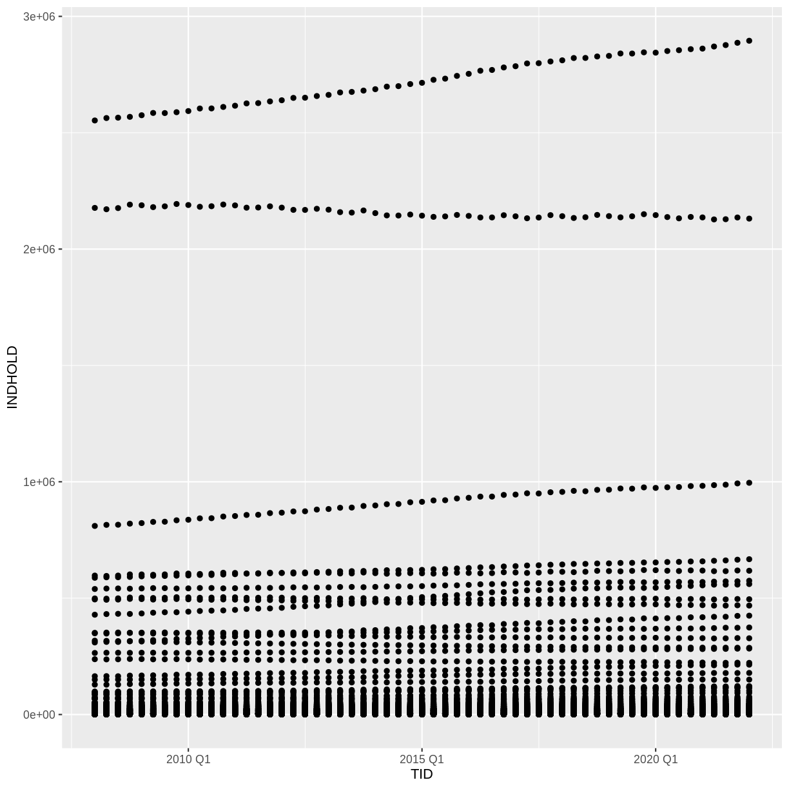
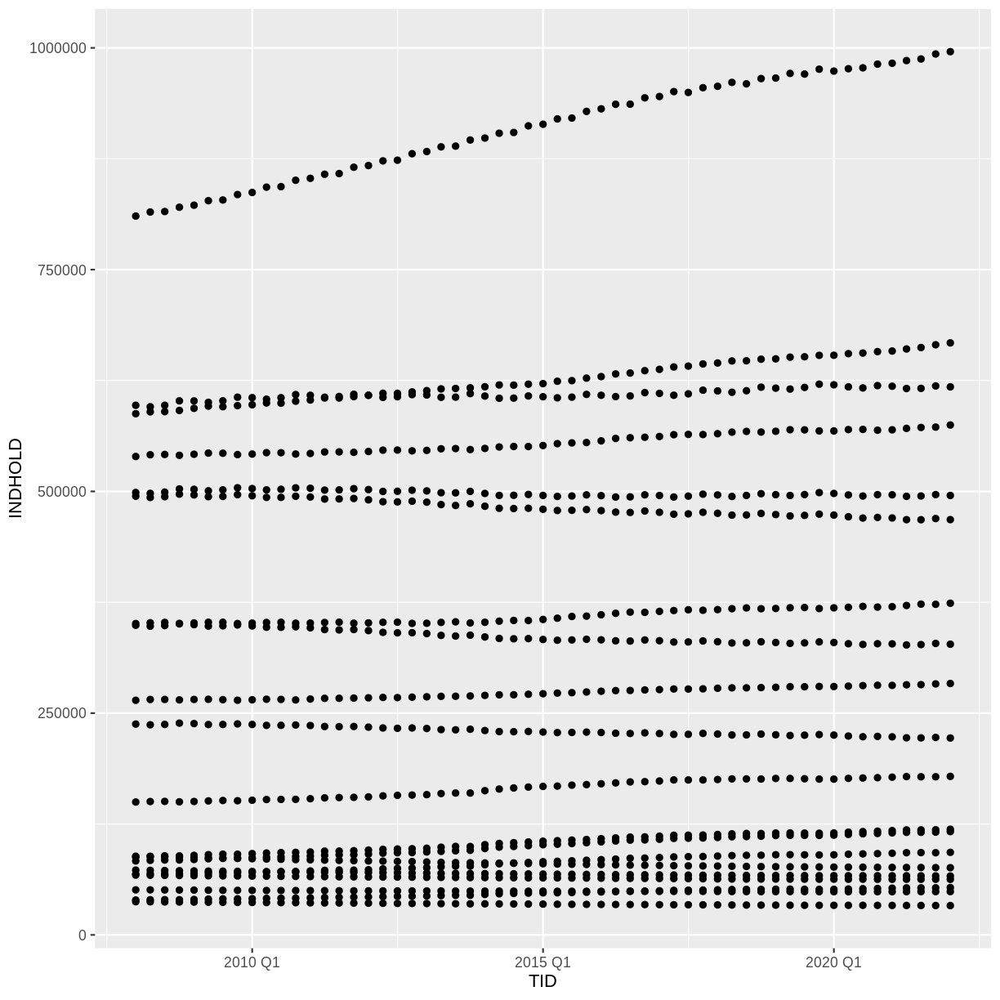
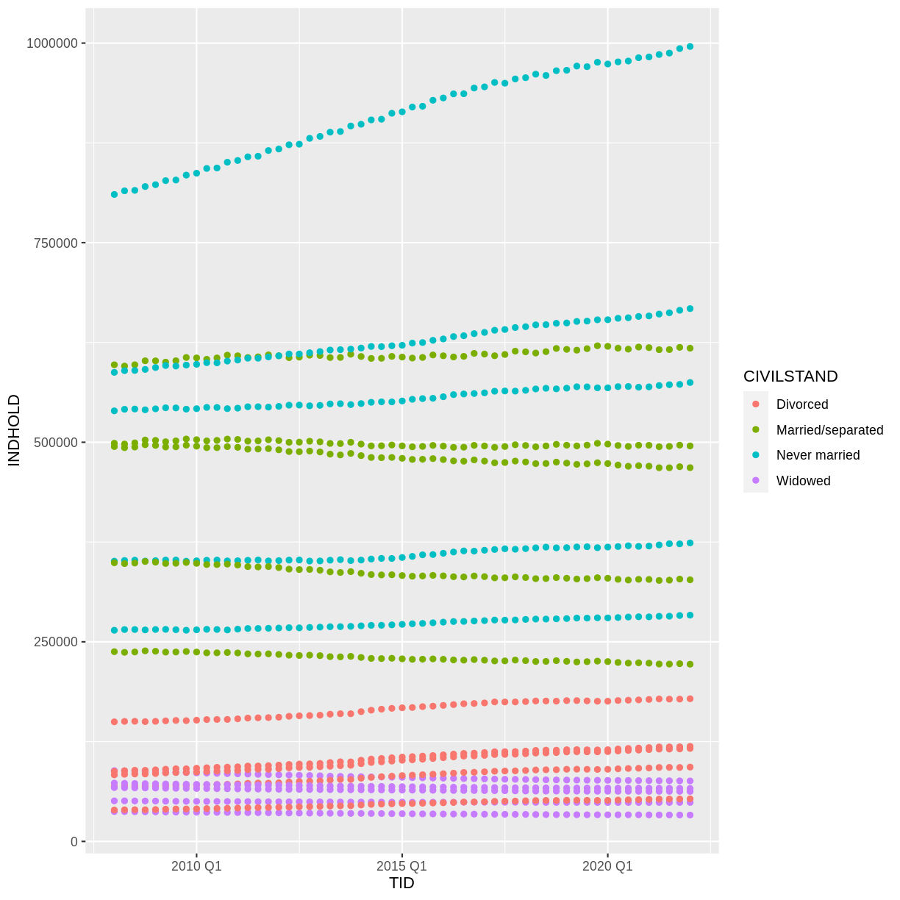
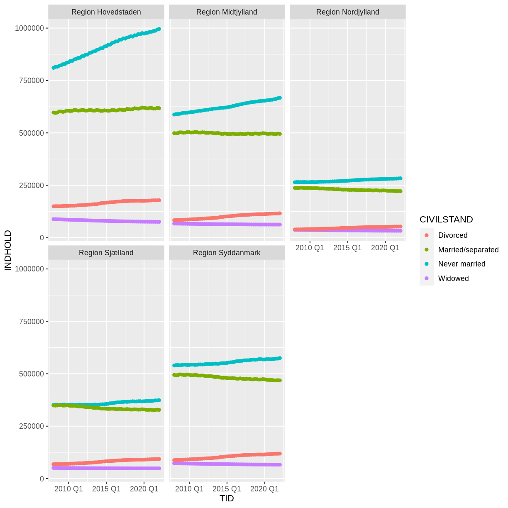
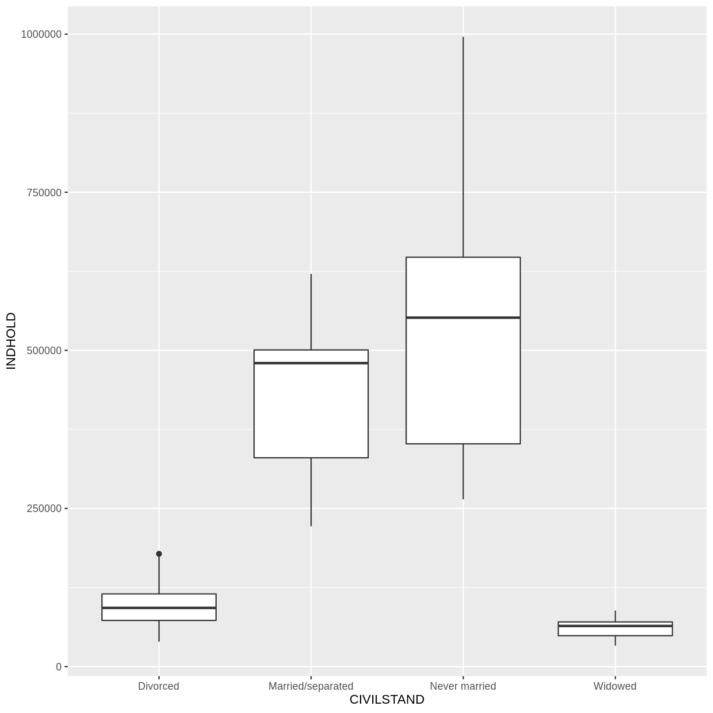
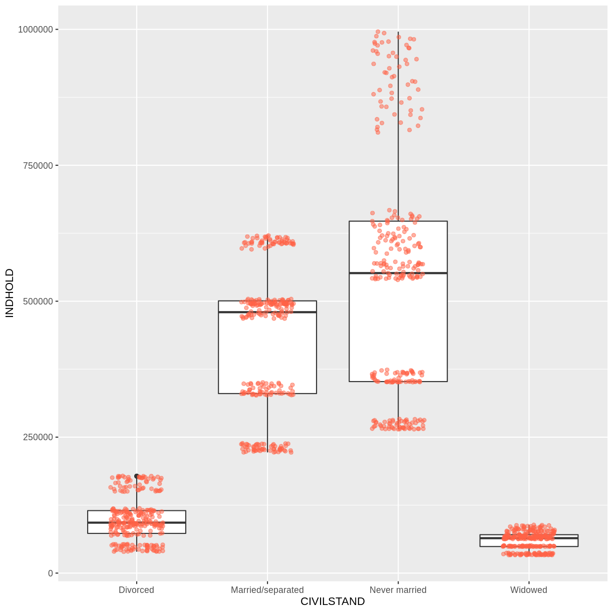

---
# Please do not edit this file directly; it is auto generated.
# Instead, please edit 07-ggplot2.md in _episodes_rmd/
title: "Data Visualisation with ggplot2"
teaching: 80
exercises: 35
questions:
  - "What are the components of a ggplot?"
  - "How do I create scatterplots, boxplots, and barplots?"
  - "How can I change the aesthetics (ex. colour, transparency) of my plot?"
  - "How can I create multiple plots at once?"
objectives:
   - "Produce scatter plots, boxplots, and barplots using ggplot."
   - "Set universal plot settings."
   - "Describe what faceting is and apply faceting in ggplot."
   - "Modify the aesthetics of an existing ggplot plot (including axis labels and colour)."
   - "Build complex and customized plots from data in a data frame."
keypoints:
   - "`ggplot2` is a flexible and useful tool for creating plots in R."
   - "The data set and coordinate system can be defined using the `ggplot` function."
   - "Additional layers, including geoms, are added using the `+` operator."
   - "Boxplots are useful for visualizing the distribution of a continuous variable."
   - "Barplots are useful for visualizing categorical data."
   - "Faceting allows you to generate multiple plots based on a categorical variable."
source: Rmd
---


Nice data. How does it look?

R has some nice plotting functions build in.

ggplot2 is a package with more, nicer, plotting possibilities.


We start by loading the required package. **`ggplot2`** is also included in the
**`tidyverse`** package.


~~~
library(tidyverse)
~~~
{: .language-r}

If not still in the workspace, load the data we saved in the previous lesson.


~~~
SD_data <- read_csv2("../data/SD_data.csv")
~~~
{: .language-r}


~~~
ℹ Using "','" as decimal and "'.'" as grouping mark. Use `read_delim()` for more control.
~~~
{: .output}


~~~
Rows: 23100 Columns: 4
~~~
{: .output}


~~~
── Column specification ────────────────────────────────────────────────────────
Delimiter: ";"
chr (3): OMRÅDE, CIVILSTAND, TID
dbl (1): INDHOLD
~~~
{: .output}


~~~

ℹ Use `spec()` to retrieve the full column specification for this data.
ℹ Specify the column types or set `show_col_types = FALSE` to quiet this message.
~~~
{: .output}

We read in data from a csv-file. That is stored as text, so we need to convert
the "TID" column to something that can be understood as time by R:


~~~
SD_data <- SD_data %>% mutate(TID = yearquarter(TID))
~~~
{: .language-r}


## Plotting with **`ggplot2`**

**`ggplot2`** is a plotting package that makes it simple to create complex plots
from data stored in a data frame. It provides a programmatic interface for
specifying what variables to plot, how they are displayed, and general visual
properties. Therefore, we only need minimal changes if the underlying data
change or if we decide to change from a bar plot to a scatterplot. This helps in
creating publication quality plots with minimal amounts of adjustments and
tweaking.

**`ggplot2`** functions work best with data in the 'long' format, i.e., a column for every
dimension, and a row for every observation. Well-structured data will save you
lots of time when making figures with **`ggplot2`**

ggplot graphics are built step by step by adding new elements. Adding layers in
this fashion allows for extensive flexibility and customization of plots.

Each chart built with ggplot2 must include the following

* Data  
* Aesthetic mapping (aes)  

  + Describes how variables are mapped onto graphical attributes  
  + Visual attribute of data including x-y axes, color, fill, shape, and alpha  
* Geometric objects (geom)  

  + Determines how values are rendered graphically, as bars (`geom_bar`), scatterplot (`geom_point`), line (`geom_line`), etc. 

Thus, the template for graphic in ggplot2 is:

```
<DATA> %>%
    ggplot(aes(<MAPPINGS>)) +
    <GEOM_FUNCTION>()
```
Remember from the last lesson that the pipe operator `%>%` places the result of the previous line(s) into the first argument of the function. **`ggplot`** is a function that expects a data frame to be the first argument. This allows for us to change from specifying the `data =` argument within the `ggplot` function and instead pipe the data into the function.

- use the `ggplot()` function and bind the plot to a specific data frame.


~~~
SD_data %>%
    ggplot()
~~~
{: .language-r}

- define a mapping (using the aesthetic (`aes`) function), by selecting the variables to be plotted and specifying how to present them in the graph, e.g. as x/y positions or characteristics such as size, shape, color, etc.


~~~
SD_data %>%
    ggplot(aes(x = TID, y = INDHOLD))
~~~
{: .language-r}

- add 'geoms' – graphical representations of the data in the plot (points,
lines, bars). **`ggplot2`** offers many different geoms; we will use some
common ones today, including:

	* `geom_point()` for scatter plots, dot plots, etc.
	* `geom_boxplot()` for, well, boxplots!
	* `geom_line()` for trend lines, time series, etc.

To add a geom to the plot use the `+` operator. Because we have two continuous variables, let's use `geom_point()` first:


~~~
SD_data %>%
    ggplot(aes(x = TID, y = INDHOLD)) +
    geom_point()
~~~
{: .language-r}


What we might note that the fact that we have ALL the municipalites leads to a
LOT of points.

We could have done that when we extracted the data from Statistics Denmark.
Alternatively we can do it now.
Let us pull out all the regions.


~~~
plot_data <- SD_data %>% 
  filter(str_detect(OMRÅDE, "Region"))
~~~
{: .language-r}

We use the filter function - we have seen before. And it returns the 
rows in the data where the expression we write in the paranthesis is true.

From the package "stringr", included in the tidyverse package, we get the 
function str_detect().

It detects if the string "Region" is present in the variable OMRÅDE. If it
is, "Region" is detected, the expression is true, and filter() leaves the row.

Back to **`ggplot2`**

The `+` in the **`ggplot2`** package is particularly useful because it allows
you to modify existing `ggplot` objects. This means you can easily set up plot
templates and conveniently explore different types of plots, so the above plot
can also be generated with code like this, similar to the "intermediate steps" 
approach in the previous lesson. We are now plotting the plot_data dataframe
instead:


~~~
# Assign plot to a variable
data_plot <- plot_data %>%
    ggplot(aes(x = TID, y = INDHOLD))

# Draw the plot as a dot plot
data_plot +
    geom_point()
~~~
{: .language-r}


A lot better.

> ## Notes
>
> - Anything you put in the `ggplot()` function can be seen by any geom layers
>   that you add (i.e., these are universal plot settings). This includes the x-
>   and y-axis mapping you set up in `aes()`.
> - You can also specify mappings for a given geom independently of the mapping
>   defined globally in the `ggplot()` function.
> - The `+` sign used to add new layers must be placed at the end of the line
>   containing the *previous* layer. If, instead, the `+` sign is added at the
>   beginning of the line containing the new layer, **`ggplot2`** will not add
>   the new layer and will return an error message.

{: .callout}


~~~
## This is the correct syntax for adding layers
data_plot +
    geom_point()

## This will not add the new layer and will return an error message
data_plot
+ geom_point()
~~~
{: .language-r}

## Building your plots iteratively

Building plots with **`ggplot2`** is typically an iterative process. We start by
defining the dataset we'll use, lay out the axes, and choose a geom:


~~~
plot_data %>%
    ggplot(aes(x = TID, y = INDHOLD)) +
    geom_point()
~~~
{: .language-r}


Then, we start modifying this plot to extract more information from it. 
We might want to color the points, based on the marriage status.

We place the color argument within the aes() function, because we want to
map the values in "CIVILSTAND" to the 

~~~
plot_data %>%
    ggplot(aes(x = TID, y = INDHOLD, color = CIVILSTAND)) +
    geom_point()
~~~
{: .language-r}



To colour each marriage status in the plot differently, you could use a vector as an input 
to the argument **`color`**.  However, because we are now mapping features of the
data to a colour, instead of setting one colour for all points, the colour of the 
points now needs to be set inside a call to the **`aes`** function. When we map 
a variable in our data to the colour of the points, **`ggplot2`** will provide a
different colour corresponding to the different values of the variable. We will 
continue to specify the value of **`alpha`**, **`width`**, and **`height`**
outside of the **`aes`** function because we are using the same value for 
every point. ggplot2 understands both the Commonwealth English and 
American English spellings for colour, i.e., you can use either `color` 
or `colour`. The plot aboge is an example where we color points by 
the **`CIVILSTAND`** of the observation.


## Faceting

We still have a lot of information
Rather than creating a single plot with points for each
region, we may want to create multiple plot, where each plot shows the
data for a single region. 

**`ggplot2`** has a special technique called *faceting* that allows the 
user to split one plot into multiple plots based on a factor included 
in the dataset. We will use it to split our plot of **CIVILSTAND** 
against time, by **OMRÅDE**, so each region has its own panel in a 
multi-panel plot:


~~~
plot_data %>%
    ggplot(aes(x = TID, y = INDHOLD, color = CIVILSTAND)) +
    geom_point() +
    facet_wrap(~OMRÅDE)
~~~
{: .language-r}



Click the "Zoom" button in your RStudio plots pane to view a larger
version of this plot.


## Boxplot

We can use boxplots to visualize the distribution of observations for each 
**CIVILSTAND**:


~~~
plot_data %>%
    ggplot(aes(x = CIVILSTAND, y = INDHOLD)) +
    geom_boxplot()
~~~
{: .language-r}


Let us be frank - a boxplot of these aggregated data is not really that 
useful. Boxplots are however so useful, that it is relevant to show how they 
are made.

By adding points to a boxplot, we can have a better idea of the number of
measurements and of their distribution:


~~~
plot_data %>%
    ggplot(aes(x = CIVILSTAND, y = INDHOLD)) +
    geom_boxplot() +
    geom_jitter(alpha = 0.5,
    		color = "tomato",
    		width = 0.2,
    		height = 0.2)
~~~
{: .language-r}


Jitter is a special way of plotting points. When we plot the points at their
exact location, we risk that some of the points overlap. geom_jitter adds a small 
bit of noise to the data, in order to spread them out. That way we can better see 
individual points.


Notice how the  boxplot layer is behind the jitter layer? What do you need to
change in the code to put the boxplot in behind the points such that it's not 
hidden?


## Barplots

Barplots are also useful for visualizing categorical data. By default,
`geom_bar` accepts a variable for x, and plots the number of instances each
value of x (in this case, wall type) appears in the dataset.


~~~
plot_data %>%
    ggplot(aes(x = CIVILSTAND)) +
    geom_bar()
~~~
{: .language-r}


We have an equal number of datapoints for each value of "CIVILSTAND". Not that
useful.

Rather than using the default "count" of values, we can use the values directly.
In that case, we need to provide both the x- and the y-values; ggplot
does not calculate them!


~~~
plot_data %>% ggplot(aes(CIVILSTAND, INDHOLD)) +
  geom_bar(stat="identity")
~~~
{: .language-r}


Now we get the values from INDHOLD plotted on the y-axis. But we get ALL the 
values from INDHOLD plotted. And we have INDHOLD from several years, from 
several administrative parts of Denmark.

Let us filter the data. 

str_detect(OMRÅDE, "Region") picks out the rows containing the text "Region".

TID == yearquarter("2008 Q1") picks out the rows containing data from 
the first quarter of 2008. Note that we have to convert "2008 Q1" to the 
same datatype as is contained in the columns, using the yearquarter() function.


~~~
plot_data %>% 
  filter(str_detect(OMRÅDE, "Region"),
         TID == yearquarter("2008 Q1")) %>% 
  ggplot(aes(CIVILSTAND, INDHOLD)) +
  geom_bar(stat= "identity")
~~~
{: .language-r}


Now we get more sensible numbers. But each bar is still the sum of the number
of divorced persons in ALL the regions. 

We can color bars by region:


~~~
plot_data %>% 
  filter(str_detect(OMRÅDE, "Region"),
         TID == yearquarter("2008 Q1")) %>% 
  ggplot(aes(CIVILSTAND, INDHOLD, color=OMRÅDE)) +
  geom_bar(stat= "identity")
~~~
{: .language-r}


Oops! Color only colors the outline of the bars. We can do better.

We can use the `fill` aesthetic for the `geom_bar()` geom to colour bars by
the portion of each count that is from each OMRÅDE.


~~~
plot_data %>% 
  filter(str_detect(OMRÅDE, "Region"),
         TID == yearquarter("2008 Q1")) %>% 
  ggplot(aes(CIVILSTAND, INDHOLD, fill=OMRÅDE)) +
  geom_bar(stat= "identity")
~~~
{: .language-r}


This creates a stacked bar chart. These are generally more difficult to read
than side-by-side bars. We can separate the portions of the stacked bar that
correspond to each OMRÅDE and put them side-by-side by using the `position`
argument for `geom_bar()` and setting it to "dodge".


~~~
plot_data %>% 
  filter(str_detect(OMRÅDE, "Region"),
         TID == yearquarter("2008 Q1")) %>% 
  ggplot(aes(CIVILSTAND, INDHOLD, fill=OMRÅDE)) +
  geom_bar(stat= "identity", position = "dodge")
~~~
{: .language-r}


## Adding Labels and Titles

By default, the axes labels on a plot are determined by the name of the variable
being plotted. However, **`ggplot2`** offers lots of customization options,
like specifying the axes labels, and adding a title to the plot with
relatively few lines of code. We will add more informative x-and y-axis
labels to our plot, a more explanatory label to the legend, and a plot title.

The `labs` function takes the following arguments: 

- `title` -- to produce a plot title
- `subtitle` -- to produce a plot subtitle (smaller text placed beneath the title) 
- `caption` -- a caption for the plot
- `...` -- any pair of name and value for aesthetics used in the plot (e.g., 
`x`, `y`, `fill`, `color`, `size`)


~~~
plot_data %>% 
  filter(str_detect(OMRÅDE, "Region"),
         TID == yearquarter("2008 Q1")) %>% 
  ggplot(aes(CIVILSTAND, INDHOLD, fill=OMRÅDE)) +
  geom_bar(stat= "identity", position = "dodge") +
  labs(title = "Civilstand by region",
       subtitle = "First quarter of 2008",
       x = "Region",
       y = "Number",
       caption = "Pattern appears similar between the regions. Data from Statistics Denmark")
~~~
{: .language-r}


Usually plots with white background look more readable when printed.  We can set
the background to white using the function `theme_bw()`. Additionally, you can remove
the grid:


~~~
plot_data %>% 
  filter(str_detect(OMRÅDE, "Region"),
         TID == yearquarter("2008 Q1")) %>% 
  ggplot(aes(CIVILSTAND, INDHOLD, fill=OMRÅDE)) +
  geom_bar(stat= "identity", position = "dodge") +
  labs(title = "Civilstand by region",
       subtitle = "First quarter of 2008",
       x = "Region",
       y = "Number",
       caption = "Pattern appears similar between the regions. Data from Statistics Denmark") +
    theme_bw() +
    theme(panel.grid = element_blank())
~~~
{: .language-r}



