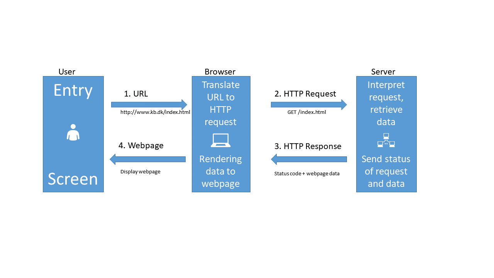
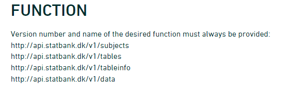

```{r setup, include = F, echo=F}
source("../bin/chunk-options.R")
knitr_fig_path("03-")
source("../bin/download_data.R")
library(remotes)
remotes::install_github("cran/danstat")
library(danstat)
library(tidyverse)
```

Please note: These pages are autogenerated. Some of the API-calls may
fail during that process. We are figuring out what to do about it, but
please excuse us for any red errors on the pages for the time being.

## What is an API?

An API is an Application Programming Interface. It is a way of making
applications, in our case an R-script, able to communicate with another
application, here the Statistics Denmark databases.

Talking about APIs, we talk about several different things. It can be
quite confusing, but dont worry!

What we want to be able to do, is to let our own application, our
R-script, send a command to a remote application, the databases of
Statistics Denmark, in order to retrieve specific data.

This is equivalent to requesting a page from a webserver.

The HTTP protocol can be visualized like this:



-   When we type in an URL in our browser, it translates that URL to a
    HTTP-request.

-   The browser sends that HTTP-request to a webserver. The request
    contains information about the page we need, but in the "header" of
    the request, there is a lot of other information. The version of
    browser we are using and cookies to just mention two.

-   The webserver interpret the request, and retrieves the data.

-   After that, the webserver sends both the status of the request
    (hopefully 200 - which is short for "everything is OK"), and the
    data.

-   The browser receives the data, and displays it as a webpage.

When we are working with APIs we cut out the user. We have a script that
needs some data. We write code that defines, and then send a request til
a server, specifying which data we need. The server extracts the needed
data, and returns it to the script.

So - how do we do that?

Looking closer at the illustration above, we can see that we send a
GET-request to the server. But we are not only asking for at simple
page, we need to specify some more information. And then we have to use
a slightly different request to the server, a POST-request.

With a POST-request we can control what data is send along with the
request, and the data returned by the server depends on what data we
send.

We are going to write a POST-request (with a little help from R), to retrieve
data from Statistics Denmark.

But before we can do that, we need to know how the SD-API expects to receive 
data.

Hopefully we can get that by reading the documentation. We can find that here:

https://www.dst.dk/en/Statistik/brug-statistikken/muligheder-i-statistikbanken/api

That was confusing!


Three main things:

Statistics Denmark provides four "functions", or "endpoints":



The first is the "web"-site we have to send requests to if we want information 
on the subjects in Statistics Denmark.

In the second we get information about which tables are available for a 
given subject.

The third will provide metadata on a table.

When we finally need the data, we will visit the last endpoint.


Let us send a request to `subjects`.

The endpoint was 
```{r}
endpoint <- "http://api.statbank.dk/v1/subjects"
```

We will now need to construct a named list for the content of the body that we send along with our request.

This is a new datastructure that we have not encountered before.

Vectors are annoying because they can only contain one datatype. And dataframes must be rectangular. 

A list allows us to store basically anything. The reason that we dont use them generally is that they are a bit more difficult to work with.

```{r}
our_body <- list(lang = "en", recursive = FALSE, 
                  includeTables = FALSE, subjects = NULL)
```
This list contains four elements, with names. The first, `lang`, contains a character vector (lenght 1), containing "en", the language that we want Statistics Denmark to use when returning data.

`recursive` and `includeTables` are logical values, both false. And `subjects` is a special value, NULL. This is not a missing value, there simply isn't anything there. But this nothing does have a name.

Now we have the two things we need, an endpoint to send a request, and a body containg what we want returned. 

Let us try it:
```{r}
result <- httr::POST(endpoint, body=our_body, encode = "json")
```

We ask to get the result in json, a speciel datastructure that is able to contain almost anything.

Let us look at the result:

```{r}
result
```
Both informative. And utterly useless. The informative information is that our request succeeded (cave - it might not succeed on this webpage). We can see that in the status. 200 is an internet code for success.

Let us get the content of the result, which is what we actually want:

```{r}
httr::content(result)
```
More informative, but not really easy to read. 

The library `jsonlite` has a function that converts this to something readable:

```{r}
jsonlite::fromJSON(httr::content(result))
```

A nice dataframe with the ten major subjects in the databases of Statistics Denmark.

Subject 1 contains information about populations and elections.

There are sub-subjects under that.
We now modify our body that we send with the request, to return information about the first subject.

We need to make sure that the number of the subject, `1` is intepreted as it is. This is a little bit of mysterious handwaving - we simply put the 1 inside the function `I()` and stuff works.

```{r}
our_body <- list(lang = "en", recursive = F, 
                  includeTables = F, subjects = I(1))
```

Note that it is important that we tell the POST function that the body is the body:

```{r}
data <- httr::POST(endpoint, body=our_body, encode = "json") %>% 
  httr::content() %>% 
  jsonlite::fromJSON()
data

```

We now get at data frame containg a dataframe. We pick that out:
```{r}
data$subjects
```

This was why the dollar-notation for subsetting dataframes is important.

These are the sub-subjects of subject 1.

Let us look closer at 3401, Population.

Again, we modify the call we send to the endpoint:
```{r}
our_body <- list(lang = "en", recursive = F, 
                  includeTables = F, subjects = I(3401))
```


```{r}
data <- httr::POST(endpoint, body=our_body, encode = "json") %>% 
  httr::content() %>% 
  jsonlite::fromJSON()
data
```

We delve deeper into it:
```{r}
data$subjects
```
And now we are at the bottom. 20021 Population figures does not have any sub-sub-subjects.

Next, let us take a look at the tables contained under subject 20021.

We need the next endpoint, which provides information about tables under a subject:

```{r}
endpoint <- "http://api.statbank.dk/v1/tables"
```

```{r}
our_body <- list(lang = "en", subjects = I(20021))
data <- httr::POST(endpoint, body=our_body, encode = "json") %>% 
  httr::content() %>% 
  jsonlite::fromJSON()
data
```

There are 21 tables under this subject. Let us see what information we can get about table "FOLK1A":

We now need the third endpoint:
```{r}
endpoint <- "http://api.statbank.dk/v1/tableinfo"
```

```{r}
our_body <- list(lang = "en", table = "FOLK1A")
data <- httr::POST(endpoint, body=our_body, encode = "json") %>% 
  httr::content() %>% 
  jsonlite::fromJSON()
data
```

This is a bit more complicated. We are told that:

1. there are five columns in this table.

2. They each have an id

3. And a descriptive text

4. Elimination means that the API will attempt to eliminate the variables we have not chosen values for when data is returned. This makes sense when we get to point 7.

5. time - only one of the variables contain information about a point in time.

6. One of the variables can be mapped to - well a map

7. The final column provides information about which values are stored in the variable. There are 105 different regions in Denmark. And if we do not choose a specific region - the API will attempt to eliminate this facetting, and return data for all of Denmark.

These data provides useful information for constructing the final call to the API in order to get the data.


We will now need the final endpoint:

```{r}
endpoint <- "http://api.statbank.dk/v1/data"
```

And we will need to specify which information, from which table, we want data in the body of the request. That is a bit more complicated. We need to make a list of lists!

```{r}
variables <- list(list(code = "OMRÅDE", values = I("*")),
                  list(code = "CIVILSTAND", values = I(c("U", "G", "E", "F"))),
                  list(code = "Tid", values = I("*"))
              )

our_body <- list(table = "FOLK1A", lang = "en", format = "CSV", variables = variables)

```

The final endpoint is:

```{r}
endpoint <- "https://api.statbank.dk/v1/data"
```

And the call:

```{r}
data <- httr::POST(endpoint, body=our_body, encode = "json")
```

The data is returned as csv - we defined that in "our_body", so we now need to extract it a bit differently:
```{r}
data <- data %>% 
  httr::content(type = "text") %>% 
  read_csv2()
data
```

Voila! We have a dataframe with information about how many persons in Denmark were married (or not) at different points in time.

That was a bit complicated. There are easier ways to do it.

We will look at that shortly. So why do it this way? These techniques are the same techniques we use when we access an arbitrary other API. The fields, endpoints etc might be different. We might have an added complication of having to login to it. But the techniques can be reused.


